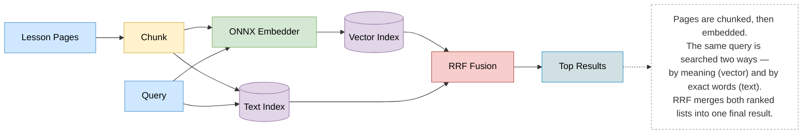

# Homework: Vector Search
In this homework, we put what we learned in Module 2 into practice.

We'll first turn text into vectors, then search by similarity. We'll also learn something new and see how to combine vector search with keyword search. We'll skip the RAG part and focus solely on search.

Like in homework 1, our knowledge base is the course lessons themselves. Each module has a lessons/ folder of numbered markdown pages, and we pull them from GitHub. We use the same commit, 8c1834d, so everyone works with the exact same 72 pages.

It's possible your answers won't match exactly. If so, select the closest one.

# Setup
In this homework we won't use the same approach for embedding as in the module. That is, we won't use the sentence-transformers library. Instead, we'll use the lightweight embedding approach with the ONNX Embedder.

Both approaches produce identical vectors, but the ONNX runtime is far lighter. It needs no PyTorch and no CUDA, which makes the installation about 30x smaller and lets it run anywhere, including a basic Codespace. We skimmed through it in the lesson and said we'd cover it in the homework - so here we are.

We prepare the environment the same way as in the module's [ONNX Runtime](https://github.com/DataTalksClub/llm-zoomcamp/blob/main/02-vector-search/lessons/09-onnx-embedder.md) lesson.

Create a fresh project and install the dependencies:

```bash
mkdir llm-zoomcamp-hw2 && cd llm-zoomcamp-hw2
uv init --no-workspace
uv add onnxruntime tokenizers numpy tqdm minsearch gitsource
uv add --dev huggingface-hub jupyter
```

We also need two helper scripts from the embed/ directory of the course repo:

- [download.py](https://github.com/DataTalksClub/llm-zoomcamp/blob/main/02-vector-search/embed/download.py) (fetches an ONNX model from HuggingFace) and
- [embedder.py](https://github.com/DataTalksClub/llm-zoomcamp/blob/main/02-vector-search/embed/embedder.py) (the Embedder class with an encode interface)

Let's download them:

```bash
PREFIX=https://raw.githubusercontent.com/DataTalksClub/llm-zoomcamp/main/02-vector-search/embed
wget $PREFIX/download.py
wget $PREFIX/embedder.py
```

By default download.py fetches Xenova/all-MiniLM-L6-v2, the ONNX version of the all-MiniLM-L6-v2 model from the lessons:

```bash
uv run python download.py
```

Now we're ready to do the homework.

## Q1. Embedding a query
Embed the following query:

`How does approximate nearest neighbor search work?`

The embedder returns a vector of 384 numbers. What's the first value (v[0])?

- -0.31
- -0.02 <-- Answer
- 0.12
- 0.44

### Steps followed:
- Create virtual envt - `python3 -m venv .venv &&  source .venv/bin/activate`
- Setup project - 
    ```bash 
        uv init --no-workspace && uv add onnxruntime tokenizers numpy tqdm minsearch gitsource && uv add --dev huggingface-hub jupyter
    ```
- Download the two helper scripts from the course repo's embed/ folder:
    ```bash
        PREFIX=https://raw.githubusercontent.com/DataTalksClub/llm-zoomcamp/main/02-vector-search/embed
        wget $PREFIX/download.py
        wget $PREFIX/embedder.py
    ```
    - `download.py` pulls the ONNX model (`Xenova/all-MiniLM-L6-v2`) from HuggingFace.
    - `embedder.py` defines the Embedder class with the `.encode()` interface — same shape as `sentence_transformers`' `model.encode()`, but backed by ONNX Runtime instead of PyTorch.
- Run the download (one-time; fetches tokenizer.json + model.onnx into models/Xenova/all-MiniLM-L6-v2/):
    ```bash
        uv run python download.py
        # Output
        02_Vector_Search % uv run python download.py
        saved models/Xenova/all-MiniLM-L6-v2/tokenizer.json
        saved models/Xenova/all-MiniLM-L6-v2/model.onnx

    ```
- Embed the query and inspect v[0]: Care and run script - 
    ```bash
        02_Vector_Search % python3 q1_embedding_a_query.py
        (384,)
        -0.020582036807885073
    ```

### Embedder.encode() does four things internally (per the lesson): tokenize the text → run it through the ONNX graph → mean-pool the token embeddings using the attention mask → L2-normalize the result. The output is a 384-dim unit vector (matching all-MiniLM-L6-v2's dimensionality), and v[0] is just its first coordinate — a fixed, deterministic value for a fixed model + input.

### Additional notes

### The actual problem: turning text into numbers
A computer can't compare "How do I install Docker?" and "Docker installation steps" by meaning — it can only compare numbers. So we need something that reads text and spits out a list of numbers (a "vector") such that:

- Similar-meaning sentences → similar-looking vectors
- Unrelated sentences → very different vectors

That's all an "embedding model" is: `text in, ~384 numbers out`. The thing that does this conversion is a neural network — a model that was trained on huge amounts of text to learn what "similar meaning" looks like in number form.

### Where sentence-transformers fits
In the earlier lessons we used the sentence-transformers Python library to run that neural network. Easy to use:

```python
model = SentenceTransformer("all-MiniLM-L6-v2")
v = model.encode("some text")
```

One line, done. The catch: under the hood, `sentence-transformers` runs on `PyTorch` — the same heavyweight framework used to train neural networks. Training needs a lot of machinery (gradient calculations, GPU support, etc.) that you don't need anymore once a model is already trained. It's like needing a whole car factory just to drive a car you already bought. That's why installing it pulls in ~4.8 GB of dependencies (PyTorch, CUDA/Nvidia libraries, etc.) — fine on your laptop, painful if you're trying to ship a small Docker container or run on a tiny server.

### Where ONNX comes in
ONNX (Open Neural Network Exchange) is just a file format for trained models — think of it like a PDF, but for neural networks. Once a model is trained (by whoever — HuggingFace, Xenova, etc.), it gets exported once into this standard .onnx file. That file contains everything needed to run the model (the learned weights, the math operations) but nothing needed to train it.

ONNX Runtime is the lightweight "player" that reads that file and executes it — analogous to a PDF reader vs. the full publishing software that created the PDF. It only needs to know how to do the math operations (matrix multiplies, etc.), not how to train or update the model. That's why it's tiny: ~147 MB vs. PyTorch's ~4.8 GB, for the exact same output vectors.

So the trade is:

| Feature                 | sentence-transformers (PyTorch) | ONNX Runtime                                 |
| ----------------------- | ------------------------------- | -------------------------------------------- |
| **What it's built for** | Training + running models       | Just running already-trained models          |
| **Size**                | ~4.8 GB                         | ~147 MB                                      |
| **Output**              | Same vectors                    | Same vectors                                 |
| **Good for**            | Notebooks, experiments          | Production, Docker, serverless, edge devices |


### How the Embedder class actually works
The model file (model.onnx) only knows how to do raw number-crunching — it doesn't know how to read English words. So there's a pipeline around it, and embedder.py's Embedder class does these 4 steps every time you call .encode(text):

1. Tokenize — chop your sentence into small pieces ("tokens", roughly word-fragments) and convert each to an integer ID, using tokenizer.json (a lookup table the model was trained with).
2. Run the ONNX model — feed those integer IDs through the neural network (the actual model.onnx file). Out comes one vector per token, not one for the whole sentence yet.
3. Mean pooling — average all those per-token vectors together into a single vector representing the whole sentence (ignoring padding tokens, via the "attention mask").
4. Normalize — rescale that vector to length 1 (a "unit vector"). This is why a simple dot product between two vectors equals their cosine similarity later — that math trick only works if both vectors have length 1.

```python
embed = Embedder()
v = embed.encode("some text")   # does all 4 steps, returns 384 numbers
```

That's identical to what sentence_transformers's model.encode() does internally — same model, same math, same output numbers (you saw this yourself: it's why your v[0] = -0.0206 answer matches what all-MiniLM-L6-v2 would also produce). The only thing that changed is which engine runs the math — PyTorch vs. ONNX Runtime.

### Summary 

`ONNX Runtime and sentence-transformers are both engines that run the same neural network (all-MiniLM-L6-v2) and encode your query into a 384-number vector.`

| Layer                              | What it is                                                                                                       | Example                                                |
| ---------------------------------- | ---------------------------------------------------------------------------------------------------------------- | ------------------------------------------------------ |
| **The neural network (the model)** | The actual trained thing — millions of learned numbers (weights) that know how to turn text into meaning vectors | `all-MiniLM-L6-v2`                                     |
| **The engine that runs it**        | The software that loads those weights and performs the computations to execute the network                       | `sentence-transformers` (uses PyTorch) or ONNX Runtime |

So all-MiniLM-L6-v2 is one single trained neural network. It was trained once, a long time ago, by someone else. You're never training anything yourself in this course — you're just running (using) an already-trained network to convert text into vectors. That process of running an already-trained model (no learning happening, just computing) is called `inference`.

The same trained network (all-MiniLM-L6-v2) has been saved in two different file formats so two different engines can run it:

- A PyTorch-format version → run by the sentence-transformers library
- An ONNX-format version → run by ONNX Runtime

Both engines load the same weights and do the same math, so they produce the same output vector. That's why your v[0] = -0.0206 matches what you'd get either way — you're not using two different models, you're using one model through two different "players."

A simpler analogy: think of all-MiniLM-L6-v2 as a song (the trained network — fixed, already made). sentence-transformers and ONNX Runtime are two different music players that can both play that exact song. The song doesn't change; only how much battery/storage the player needs changes.

----------------------------------------------------------------

## Loading the data
We pull the lesson pages from the course repository, the same way as in homework 1. We pin to commit 8c1834d so everyone works with the same data.

```python
from gitsource import GithubRepositoryDataReader

reader = GithubRepositoryDataReader(
    repo_owner="DataTalksClub",
    repo_name="llm-zoomcamp",
    commit_id="8c1834d",
    allowed_extensions={"md"},
    filename_filter=lambda path: "/lessons/" in path,
)

documents = [file.parse() for file in reader.read()]
```

Each document is a dictionary with a filename and content, and there are 72 pages.

-----------------------------------------

## Q2. Cosine similarity
The embedder returns normalized vectors, so the dot product between two of them is their cosine similarity.

Take the page 02-vector-search/lessons/07-sqlitesearch-vector.md, embed its content, and compute the cosine similarity with the query vector from Q1. What do you get?

- 0.07
- 0.37 <-- answer
- 0.68
- 0.92

### Steps Followed - 

- Embed the query (same as Q1): run `python3 q1_embedding_a_query.py`
- Get the page's raw text and embed it. In the real homework you'd pull this from documents (loaded via gitsource.GithubRepositoryDataReader, filtering for filename == "02-vector-search/lessons/07-sqlitesearch-vector.md"). I fetched the same file directly:
```python
with open("07-sqlitesearch-vector.md") as f:
    content = f.read()

d = embed.encode(content)
```
- Dot product = cosine similarity:
```python
similarity = v.dot(d)
print(similarity)
```
- Create and run q2_cosine_similarity.py
```bash
 02_Vector_Search % python3 q2_cosine_similarity.py
0.361070280302606
```

--------------------------------------------------------------

## Q3. Chunking and search by hand
A full page covers several topics, which waters down its embedding.

We chunk the pages the same way as in homework 1:

```python
from gitsource import chunk_documents
chunks = chunk_documents(documents, size=2000, step=1000)
```

We embed every chunk's content with encode_batch, stack the vectors into a matrix X, and score the Q1 query against all chunks:

```python
scores = X.dot(v)
```

Which file does the highest-scoring chunk belong to (its filename)?

- 02-vector-search/lessons/03-embeddings-dataset.md
- 02-vector-search/lessons/06-rag-vector.md
- 02-vector-search/lessons/07-sqlitesearch-vector.md <-- answer
- 02-vector-search/lessons/09-onnx-embedder.md

In Q2 we saw that embedding the entire 07-sqlitesearch-vector.md page only scored 0.37 against the query, even though that page actually contains a paragraph specifically explaining ANN search (the "NN vs ANN" section). The page also covers indexing, filtering, closing connections, comparisons to other tools — all of that got mixed into one average vector, diluting the part that actually answers the query.

Chunking fixes this by splitting each page into smaller overlapping windows of text, so each chunk stays focused on a narrower topic instead of the whole page's mixed bag.

### Steps followed - 

1. Load all 72 lesson pages (same reader as before, but now across all modules, not just one file):

```python
from gitsource import GithubRepositoryDataReader

reader = GithubRepositoryDataReader(
    repo_owner="DataTalksClub",
    repo_name="llm-zoomcamp",
    commit_id="8c1834d",
    allowed_extensions={"md"},
    filename_filter=lambda path: "/lessons/" in path,
)
documents = [file.parse() for file in reader.read()]
```

2. Chunk every page into overlapping windows:

```python
from gitsource import chunk_documents

chunks = chunk_documents(documents, size=2000, step=1000)
```

- size=2000 → each chunk is up to 2000 characters.
- step=1000 → start the next chunk 1000 characters later, so consecutive chunks overlap by half. This overlap matters: it avoids accidentally splitting a relevant sentence right at the boundary between two chunks and losing it from both.

Each chunk keeps a filename (which page it came from) and a start (its offset within that page) — that's how you trace a chunk back to its source page. From 72 pages this produced 295 chunks.

3. Embed every chunk in one batch call (encode_batch is just the batched version of encode — faster than calling .encode() 295 times in a loop):

```python
texts = [c["content"] for c in chunks]
vectors = embed.encode_batch(texts)

import numpy as np
X = np.array(vectors)   # shape: (295, 384)
```

4. Score every chunk against the Q1 query vector — same trick as the original numpy lesson (matrix-vector dot product = cosine similarity per row, since vectors are normalized):

```python
scores = X.dot(v)
idx = scores.argmax()
chunks[idx]["filename"]
```

5. Create and run script `q3_chunking_and_search_by_hand.py`
```bash
02_Vector_Search % python3 q3_chunking_and_search_by_hand.py

0.6489 02-vector-search/lessons/07-sqlitesearch-vector.md
0.551 01-agentic-rag/lessons/05-search.md
0.4066 04-evaluation/lessons/05-search-metrics.md
0.4062 02-vector-search/lessons/04-vector-search.md
0.4061 06-best-practices/lessons/03-reranking.md
```

## Q4. Vector search with minsearch
We've done vector search by hand, which is good for learning, but it's not what we do in practice. In practice we use libraries.

Let's use VectorSearch from minsearch and run a search for the following query:

`What metric do we use to evaluate a search engine?`

Which file is the filename of the first result?

- 02-vector-search/lessons/04-vector-search.md
- 04-evaluation/lessons/05-search-metrics.md <-- answer
- 04-evaluation/lessons/13-llm-as-judge.md
- 05-monitoring/lessons/04-metrics.md

### Why use a library instead of doing it by hand
Q3 did vector search "by hand": building the matrix X, computing X.dot(v), sorting with argsort. That works, but in practice you'd reach for a library that wraps all of it — minsearch.VectorSearch, same one used in the lessons.

### Steps followed - 

1. Reuse the chunks + embeddings from Q3 — same chunks list and X matrix

```python
from minsearch import VectorSearch

vindex = VectorSearch()
vindex.fit(X, chunks)
```

- X is the matrix of all 295 chunk vectors.
- chunks is the payload — the actual data (filename, start, content) returned alongside each match, so you know which chunk and which file scored well.

2. Embed the new query the same way as always — vector search needs a vector, not raw text:

```python
query = "What metric do we use to evaluate a search engine?"
qv = embed.encode(query)
```

3. Search:
```pythin
results = vindex.search(qv, num_results=5)
results[0]["filename"]
```
Under the hood vindex.search does exactly what Q3 did manually (dot product against every row of X, then sort), it's just packaged behind a clean API.

4. Create nd run 
```bash
02_Vector_Search % python3 q4_vector_search_with_minsearch.py

04-evaluation/lessons/05-search-metrics.md <-- answer
04-evaluation/lessons/01-intro.md
01-agentic-rag/lessons/05-search.md
04-evaluation/lessons/01-intro.md
04-evaluation/lessons/15-next-steps.md
```

## Q5. Text search vs vector search
Vector search matches by meaning, keyword search by exact words.

Let's compare them. Index the same chunks with Index from minsearch. Use content as a text field.

Run both searches for this query:

`How do I store vectors in PostgreSQL?`

Take the top 5 results from each method. Which file shows up in the vector results but not in the text results?

- 02-vector-search/lessons/01-intro.md
- 02-vector-search/lessons/02-embeddings.md
- 02-vector-search/lessons/08-pgvector.md <-- answer
- 03-orchestration/lessons/05-rag.md

### What's being compared
Same chunks, same query, two completely different search engines:

- Vector search (VectorSearch) — matches by meaning (embeddings + cosine similarity), what we've used in Q3/Q4.
- Text search (Index) — matches by exact words (BM25-style keyword matching), the same kind of search used in Module 1.

The idea: run the same query through both, then see where they disagree.

### Steps followed - 
1. Build a text index over the same chunks, using content as the field to search:

```python
from minsearch import Index

tindex = Index(text_fields=["content"])
tindex.fit(chunks)
```
This is unrelated to embeddings entirely — no vectors involved, it indexes the raw words in each chunk's content.

2. Reuse the vector index from Q4 (vindex, built on X + chunks

3. Run the same query through both:

```python
query = "How do I store vectors in PostgreSQL?"

qv = embed.encode(query)                      # vector search needs an embedded query
vector_results = vindex.search(qv, num_results=5)

text_results = tindex.search(query, num_results=5)   # text search takes the raw string directly
```

Note the asymmetry: vector search needs the query embedded first, text search takes the plain string as-is — that's the core difference between the two approaches you've been seeing all module.

4. Compare the two top-5 lists to find a file that's in vector results but missing from text results:

```python
vfiles = [r["filename"] for r in vector_results]
tfiles = [r["filename"] for r in text_results]

for f in vfiles:
    if f not in tfiles:
        print(f)
```

5. Create and run file 
```bash
(.venv) niteshmishra@Mac 02_Vector_Search % python3 q5_text_search_vs_vector_search.py
Top 5 results of vector search
02-vector-search/lessons/08-pgvector.md
02-vector-search/lessons/08-pgvector.md
03-orchestration/lessons/05-rag.md
02-vector-search/lessons/08-pgvector.md
02-vector-search/lessons/08-pgvector.md


Top 5 results of text search
02-vector-search/lessons/02-embeddings.md
03-orchestration/lessons/05-rag.md
02-vector-search/lessons/01-intro.md
03-orchestration/lessons/05-rag.md
02-vector-search/lessons/01-intro.md


Answer to q5 - Which file shows up in the vector results but not in the text results?
02-vector-search/lessons/08-pgvector.md <-- answer
02-vector-search/lessons/08-pgvector.md <-- answer
02-vector-search/lessons/08-pgvector.md <-- answer
02-vector-search/lessons/08-pgvector.md <-- answer
```

### Result from running it
```
--- vector results ---
02-vector-search/lessons/08-pgvector.md   (x4 chunks)
03-orchestration/lessons/05-rag.md

--- text results ---
02-vector-search/lessons/02-embeddings.md
03-orchestration/lessons/05-rag.md   (x2 chunks)
02-vector-search/lessons/01-intro.md  (x2 chunks)
```

02-vector-search/lessons/08-pgvector.md dominates the vector results (4 of its chunks land in the top 5) but never appears at all in the text search results.

#### Why this happens
It's almost counterintuitive at first — 08-pgvector.md is literally the lesson about storing vectors in PostgreSQL, yet keyword search misses it entirely. That's exactly the weakness called out in the lessons: BM25-style text search scores chunks by exact word frequency/overlap. The pgvector lesson's chunks are full of SQL/Python code (CREATE TABLE, vector(384), psycopg, <=>) rather than prose repeating the words "store," "vectors," and "PostgreSQL" together in natural sentences. Vector search doesn't care about exact wording — it recognizes the chunk is about storing vectors in Postgres based on meaning, even though the surface text looks different from the query.

## Q6. Hybrid search
Both vector and text search have their strengths and weaknesses. Vector search matches by meaning, so it finds relevant pages even when they use words different from the query. But it can miss exact terms like names, codes, or rare keywords. Text search is the opposite: it nails exact words but misses paraphrases and synonyms.

We don't have to pick one or the other - we can use both and merge their results. This approach is called "hybrid search".

Each search produces its own ranked list, so we need a way to combine them into one. In this homework we use `Reciprocal Rank Fusion (RRF)`. It ignores the raw scores from each method, which live on different scales and aren't directly comparable. Instead, it looks only at the position of each document in each list.

Every document scores by its position (rank, starting at 0) in each list, and we sum the scores across lists with a constant k = 60:

```python
RRF(d) = sum over lists of  1 / (k + rank(d))
```

"Sum over lists" means we go through every ranked list and, for each list where the document appears, add its 1 / (k + rank) contribution. A document found by both searches collects a score from each list, while one found by only a single search collects just one.

The constant k controls how much the exact rank matters. A larger k flattens the gap between positions, so the difference between rank 0 and rank 5 counts for less. A smaller k does the opposite: it sharpens that gap, so being at the top of a list matters much more.

The value 60 comes from the original RRF paper and is the usual default. You rarely need to tune it. Lower it when only the top results matter. Raise it to reward documents that appear across many lists, even when they never quite reach the top.

A document that ranks well in both lists ends up higher than one that's only strong in a single list.

```python
def rrf(result_lists, k=60, num_results=5):
    scores = {}
    docs = {}

    for results in result_lists:
        for rank, doc in enumerate(results):
            key = (doc["filename"], doc["start"])
            scores[key] = scores.get(key, 0) + 1 / (k + rank)
            docs[key] = doc

    ranked = sorted(scores, key=scores.get, reverse=True)
    return [docs[key] for key in ranked[:num_results]]
```

Now run the query `"How do I give the model access to tools?"` with vector and text search and fuse the results with rrf:

```python
results = rrf([vector_results, text_results])
```

Which file is ranked first after RRF?

- 01-agentic-rag/lessons/01-intro.md
- 01-agentic-rag/lessons/13-function-calling.md <-- answer
- 01-agentic-rag/lessons/14-agentic-loop.md
- 01-agentic-rag/lessons/16-other-frameworks.md

Notice that this file isn't first in either search on its own - it wins because it ranks high in both.

### The idea

Vector search and text search each return their own ranked list for the same query. Instead of picking one list as "the truth," Reciprocal Rank Fusion (RRF) merges both lists by looking only at position (rank), not raw scores — because vector similarity scores (0 to 1) and BM25 text scores live on completely different scales and can't be compared directly.

For every chunk, in every list it appears in, it earns:

```
1 / (k + rank)
```

where rank starts at 0 (top position) and k = 60 is a damping constant. A chunk's total RRF score is the sum of this across however many lists it appears in. A chunk that shows up in both lists collects a contribution from each — so even a so-so rank in two lists can outscore a great rank in just one.

### Steps followed - 

1. Run both searches as usual (same vindex/tindex from Q4/Q5, new query):

```python
query = "How do I give the model access to tools?"
qv = embed.encode(query)

vector_results = vindex.search(qv, num_results=5)
text_results = tindex.search(query, num_results=5)
```

2. Fuse them with the rrf function (given in the homework):

```python
def rrf(result_lists, k=60, num_results=5):
    scores = {}
    docs = {}
    for results in result_lists:
        for rank, doc in enumerate(results):
            key = (doc["filename"], doc["start"])   # identifies one specific chunk
            scores[key] = scores.get(key, 0) + 1 / (k + rank)
            docs[key] = doc
    ranked = sorted(scores, key=scores.get, reverse=True)
    return [docs[key] for key in ranked[:num_results]]

results = rrf([vector_results, text_results])
results[0]["filename"]
```

Note the key = (doc["filename"], doc["start"]) — it identifies a chunk by both its file and its position within that file, not just the filename. So two different chunks from the same file are treated as separate entries unless they're the exact same chunk in both lists.

3. Create and run file

```bash
 02_Vector_Search % python3 q6_hybrid_search.py
Top 5 results of vector search
rank 0: 01-agentic-rag/lessons/01-intro.md
rank 1: 04-evaluation/lessons/02-ground-truth.md
rank 2: 01-agentic-rag/lessons/16-other-frameworks.md
rank 3: 01-agentic-rag/lessons/15-frameworks.md
rank 4: 01-agentic-rag/lessons/13-function-calling.md <-- low rank here


Top 5 results of text search
rank 0: 01-agentic-rag/lessons/14-agentic-loop.md
rank 1: 01-agentic-rag/lessons/13-function-calling.md <-- decent rank here
rank 2: 01-agentic-rag/lessons/13-function-calling.md
rank 3: 01-agentic-rag/lessons/13-function-calling.md
rank 4: 04-evaluation/lessons/02-ground-truth.md


Top 5 results of RRF fused
0: 01-agentic-rag/lessons/13-function-calling.md <-- answer
1: 01-agentic-rag/lessons/01-intro.md
2: 01-agentic-rag/lessons/14-agentic-loop.md
3: 04-evaluation/lessons/02-ground-truth.md
4: 01-agentic-rag/lessons/16-other-frameworks.md
```

### Why 13-function-calling.md wins despite never being #1 anywhere
It's only rank 4 (last place) in vector search, and never better than rank 1 in text search — it's not the top pick in either list individually. But it's the only file appearing meaningfully in both lists, plus one of its specific chunks happens to be returned by both searches, so that chunk's score gets the 1/(60+rank) contribution added twice (once from each list) — pushing its combined total above any chunk that only appears once.

Hybrid search rewards documents that are consistently relevant across different retrieval signals, not just documents that happen to nail one method's particular scoring quirk.

## Final Architecture diagram



