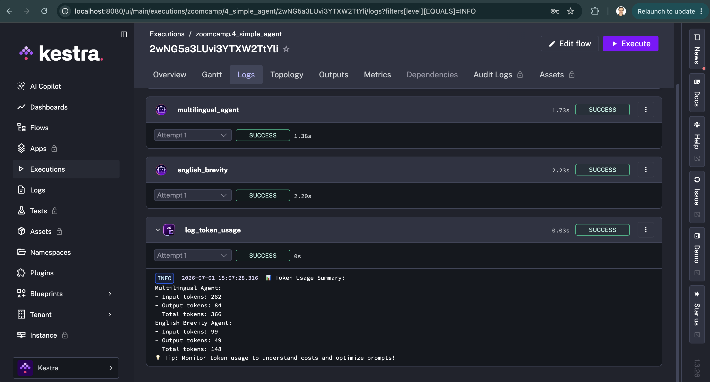

# Homework: AI Orchestration with Kestra
ATTENTION: At the end of the submission form, you will be required to include a link to your GitHub repository or other public code-hosting site. This repository should contain your code for solving the homework. If your solution includes code that is not in file format, please include these directly in the README file of your repository.

`It's possible your answers won't match exactly. If so, select the closest one`

## Prerequisites
Before starting this homework, ensure you have:

1. Completed the Module 3 lessons — the questions reference flows and concepts covered there
2. Kestra running locally with API keys configured (see the Setup lesson) -- this includes the Gemini API key, which is also required for the AI Copilot
3. Imported all flows from the 03-orchestration/flows/ directory (covered in the Setup lesson)

## Question 1: Context Engineering
Try the following experiment:

1. Open ChatGPT in a private browser window: https://chatgpt.com
2. Enter this prompt: "Create a Kestra flow that loads NYC taxi data from CSV to BigQuery"
3. Then, use Kestra's AI Copilot with the same prompt

After trying the same prompt in ChatGPT vs Kestra's AI Copilot, what is the primary reason AI Copilot generates better Kestra flows?

1. AI Copilot uses a more powerful model
2. AI Copilot has access to current Kestra plugin documentation <-- answer
3. AI Copilot uses more tokens
4. AI Copilot has internet access

## Question 2: RAG vs No RAG
Run both 1_chat_without_rag.yaml and 2_chat_with_rag.yaml in the Kestra UI. Read the execution logs for each.

The non-RAG response about Kestra 1.1 features is best described as:

1. Accurate and specific, matching the actual release notes
2. Vague, generic, or fabricated — the model guesses from training data <-- answer
3. Empty — the model refuses to answer without context
4. Identical to the RAG version

## Question 3: Token usage — short summary
Run 4_simple_agent.yaml with summary_length = short (leave the other inputs as defaults).

Open the execution logs and find the token usage logged by the log_token_usage task.

What is the approximate output token count for multilingual_agent?

1. 5-15 tokens
2. 60-100 tokens <-- answer
3. 200-400 tokens
4. 500+ tokens

### Steps followed - 
1. Create virtual envt - `python3 -m venv .venv &&  source .venv/bin/activate`
2. Get Docker running
3. Get a Gemini API key - 
    Go to [Google AI Studio](https://aistudio.google.com/apikey) and create a free API key — this is needed for AI Copilot and the agent flows (GEMINI_API_KEY).
4. Start Kestra locally
    Run this in a terminal:
    ```bash
    docker run --pull=always --rm -it -p 8080:8080 --user=root \
    -v /var/run/docker.sock:/var/run/docker.sock \
    -v /tmp:/tmp \
    -e SECRET_GEMINI_API_KEY=$(echo -n "$GEMINI_API_KEY" | base64) \
    kestra/kestra:latest server local
    ```
5. Open the UI and log in
    - Go to http://localhost:8080 in your browser.
    - Local/standalone Kestra (OSS) has no login screen by default — it opens straight into the UI. You only see a login prompt if you're using Kestra Enterprise/Cloud, or if you've explicitly configured basic auth in a custom config file.
6. Add the Gemini API key as a secret
Command used in Step 4 will pull key fomr .zshrc from local shell envt. 
7. Import the homework flows
In the Kestra UI: Flows → Create → Import, and upload YAML file 
8. Execute a flow
Open the flow → Execute → fill in inputs (e.g. summary_length: short) → Execute, then check the Logs tab of the execution for the log_token_usage output.

### Output
```
2026-07-01 15:07:28.316📊 Token Usage Summary:
Multilingual Agent:
- Input tokens: 282
- Output tokens: 84
- Total tokens: 366
English Brevity Agent:
- Input tokens: 99
- Output tokens: 49
- Total tokens: 148
💡 Tip: Monitor token usage to understand costs and optimize prompts!
```

### Screenshot


## Question 4: Token usage — long summary
Run 4_simple_agent.yaml again with summary_length = long.

Compare the multilingual_agent output token count to your result from Question 3. Roughly how many times more output tokens does the long summary use?

1. About the same (within 20%)
2. 2-5x more <-- answer
3. 10-20x more
4. 50x more

### Output - 
```
2026-07-01 15:15:08.171📊 Token Usage Summary:
Multilingual Agent:
- Input tokens: 282
- Output tokens: 210
- Total tokens: 492
English Brevity Agent:
- Input tokens: 225
- Output tokens: 52
- Total tokens: 277
💡 Tip: Monitor token usage to understand costs and optimize prompts!
```

## Question 5: Modifying a flow
Open 4_simple_agent.yaml in the Kestra flow editor. Find the english_brevity task and change its prompt from asking for exactly 1 sentence to asking for exactly 3 sentences.

Save the flow, then run it with summary_length = long.

Compare the english_brevity output token count to the original 1-sentence version (also with summary_length = long). How do they compare?

1. About the same (within 20%) <-- answer
2. 2-4x more
3. 5-10x more
4. 10x+ more

### Output - 
```
INFO 2026-07-01T22:19:56.437196Z 📊 Token Usage Summary:

Multilingual Agent:
- Input tokens: 282
- Output tokens: 181
- Total tokens: 463

English Brevity Agent:
- Input tokens: 196
- Output tokens: 94 <-- token count and 52 as per Q4
- Total tokens: 290

💡 Tip: Monitor token usage to understand costs and optimize prompts!
```

## Question 6: Best Practices
Based on what you learned in this module, for production workflows requiring deterministic, repeatable results with strict compliance requirements (e.g., financial reporting, workflows in highly regulated industries), which approach is most appropriate?

1. Always use AI agents for maximum flexibility and adaptation
2. Use traditional task-based workflows for predictability and auditability <-- answer
3. Use only RAG without agents for better performance
4. Use web search tools exclusively to ensure current data

Reasoning: the question specifically calls out deterministic, repeatable results and strict compliance (financial reporting, regulated industries). RAG still involves an LLM generating free-form text — even with grounding, output isn't guaranteed deterministic or fully auditable step-by-step. Traditional task-based Kestra workflows (explicit steps, no LLM in the decision path) are the ones that give you predictable, reproducible, auditable execution — which is the core theme this module keeps returning to (LLMs are great for flexibility/exploration, but not for compliance-critical determinism).