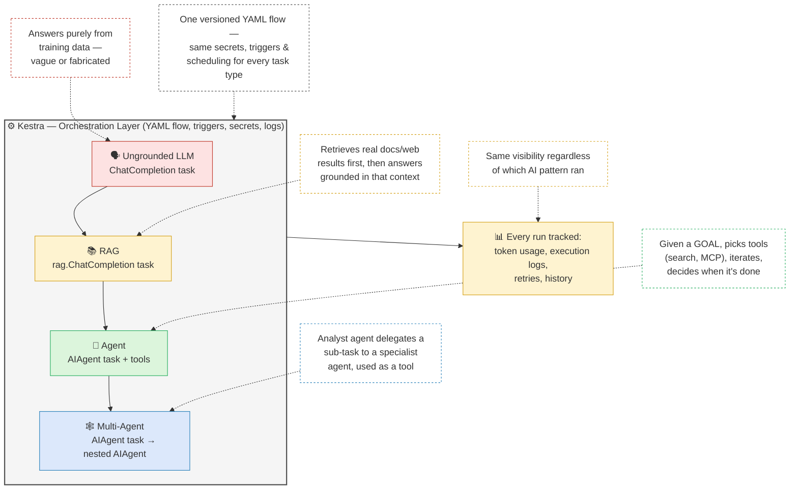

# Module 3: AI Orchestration with Kestra

This module covers workflow orchestration using [Kestra](https://kestra.io), an open-source orchestration platform. It progresses from foundational concepts about reliable AI use through to autonomous multi-agent systems, teaching how to combine deterministic workflows with AI-driven flexibility.

Curriculum by Will Russell (Kestra team), part of the [LLM Zoomcamp](https://github.com/DataTalksClub/llm-zoomcamp).

## Learning Objectives

- Use Kestra's AI Copilot to accelerate flow development
- Implement Retrieval Augmented Generation (RAG) to ground AI responses in real data
- Build autonomous agents capable of dynamic decision-making and tool usage
- Design collaborative multi-agent systems
- Apply production-ready practices for cost, security, and observability

## Prerequisites

- Kestra installed and running locally (Docker)
- A Google Cloud account with Gemini API access (free tier available)
- Basic familiarity with YAML and workflow concepts

## Core Rationale

> "AI is only as good as the context we provide."

Generic AI assistants (e.g. plain ChatGPT) don't know your specific plugin versions, current documentation, or organizational workflow patterns — they're trained on data up to a fixed cutoff and will hallucinate outdated syntax, wrong property names, or invented features. Embedding AI directly into Kestra via context engineering, RAG, and specialized agents keeps generated workflows accurate and production-ready.

## Lessons

### 1. Intro

Covers the module's learning objectives, prerequisites (Kestra installed locally, a Google Cloud account with Gemini API access, basic YAML/workflow knowledge), and the rationale for bringing AI into orchestration. Traditional AI assistants lack awareness of your specific codebase, real-time system data, and organizational workflow patterns — embedding AI orchestration directly into Kestra via context engineering, RAG, and specialized agents lets you generate workflows faster, reduce errors, and automate more sophisticated decisions while keeping outputs grounded in accurate information.

### 2. Context Engineering

Explains why generic AI assistants fail at generating accurate Kestra flows: LLMs are trained on data up to a fixed point in time, so they can't account for plugin updates, API changes, or renamed properties. Without proper guidance this produces hallucinations — outdated syntax, incorrect property names, or entirely fabricated features. Context engineering means supplying the AI with current, specific information (documentation, config details, org best practices) before asking it to generate code, so that "with proper context, AI generates accurate, current, production-ready code you can iterate on quickly."

### 3. Setup

Environment configuration:
- **Docker** — start Kestra via the provided `docker-compose.yml` with `docker compose up -d`, then open the UI at `http://localhost:8080`.
- **API keys** — three used across the module: **Gemini** (Google AI Studio, free tier with rate limits), **OpenAI** (platform.openai.com, needed for one flow), and **Tavily** (web search, 1,000 free searches/month).
- **Secrets** — export keys as base64-encoded env vars prefixed `SECRET_`:
  ```bash
  export SECRET_GEMINI_API_KEY=$(echo -n "your-key" | base64)
  export SECRET_OPENAI_API_KEY=$(echo -n "your-key" | base64)
  export SECRET_TAVILY_API_KEY=$(echo -n "your-key" | base64)
  ```
  Reference them in flows as `{{ secret('GEMINI_API_KEY') }}` (without the `SECRET_` prefix).
- **Importing flows** — via curl with default credentials (`admin@kestra.io` / `Admin1234!`) or by pasting YAML directly into the UI; six pre-configured flows ship in the `zoomcamp` namespace.
- **Critical note**: never commit API keys to Git — store them securely and never hardcode them in version control.

### 4. AI Copilot

Kestra's AI Copilot generates flow structures directly from natural language descriptions instead of requiring manual task-by-task construction. It stays accurate by referencing current plugin documentation, valid property names, and best practices specific to your installed Kestra version — the key advantage over generic AI tools.

The **"5% Rule"**: Copilot handles the bulk of structural scaffolding, leaving you to make small targeted adjustments (credentials, error-handling preferences) for your environment. It supports iterative refinement — cumulative prompts progressively adding features like validation, scheduling, or notifications — and there's an agent-skills repository for developers who want reliable flow generation from external coding assistants (e.g. this very Claude Code session).

### 5. RAG (Retrieval Augmented Generation)

RAG solves the hallucination problem by grounding AI responses in real data: it retrieves relevant information from your data sources, augments the prompt with that context, and generates an answer based on it. Two phases:
- **Ingest phase** (run once or periodically): extract documents → generate vector embeddings → persist them in storage (typically a vector database).
- **Query phase** (on demand): convert the user's question into an embedding → find semantically similar stored vectors → inject the matching content into the LLM prompt → generate a grounded answer.

**Without RAG** — the model only has its training data to go on (`1_chat_without_rag.yaml`):

```yaml
id: 1_chat_without_rag
namespace: zoomcamp

tasks:
  - id: chat_without_rag
    type: io.kestra.plugin.ai.completion.ChatCompletion
    provider:
      type: io.kestra.plugin.ai.provider.GoogleGemini
      modelName: gemini-2.5-flash
      apiKey: "{{ secret('GEMINI_API_KEY') }}"
    messages:
      - type: USER
        content: |
          Which features were released in Kestra 1.1?
          Please list at least 5 major features with brief descriptions.
```

**Static RAG** — ingest a document once, then query against it (`2_chat_with_rag.yaml`):

```yaml
id: 2_chat_with_rag
namespace: zoomcamp

tasks:
  - id: ingest_release_notes
    type: io.kestra.plugin.ai.rag.IngestDocument
    provider:
      type: io.kestra.plugin.ai.provider.GoogleGemini
      modelName: gemini-embedding-001
      apiKey: "{{ secret('GEMINI_API_KEY') }}"
    embeddings:
      type: io.kestra.plugin.ai.embeddings.KestraKVStore
    drop: true
    fromExternalURLs:
      - https://raw.githubusercontent.com/kestra-io/docs/refs/heads/main/src/contents/blogs/release-1-1/index.md

  - id: chat_with_rag
    type: io.kestra.plugin.ai.rag.ChatCompletion
    chatProvider:
      type: io.kestra.plugin.ai.provider.GoogleGemini
      modelName: gemini-2.5-flash
      apiKey: "{{ secret('GEMINI_API_KEY') }}"
    embeddingProvider:
      type: io.kestra.plugin.ai.provider.GoogleGemini
      modelName: gemini-embedding-001
      apiKey: "{{ secret('GEMINI_API_KEY') }}"
    embeddings:
      type: io.kestra.plugin.ai.embeddings.KestraKVStore
    systemMessage: |
      You are a helpful assistant that answers questions about Kestra.
      Use the provided documentation to give accurate, specific answers.
      If you don't find the information in the context, say so.
    prompt: |
      Which features were released in Kestra 1.1?
      Please list at least 5 major features with brief descriptions.
```

**Web-search RAG** — retrieve live results at query time instead of a pre-ingested store (`3_rag_with_websearch.yaml`):

```yaml
id: 3_rag_with_websearch
namespace: zoomcamp

tasks:
  - id: chat_with_rag_and_websearch_content_retriever
    type: io.kestra.plugin.ai.rag.ChatCompletion
    chatProvider:
      type: io.kestra.plugin.ai.provider.OpenAI
      apiKey: "{{ secret('OPENAI_API_KEY') }}"
      modelName: gpt-5-mini
    contentRetrievers:
      - type: io.kestra.plugin.ai.retriever.TavilyWebSearch
        apiKey: "{{ secret('TAVILY_API_KEY') }}"
    systemMessage: You are a helpful assistant that can answer questions about Kestra.
    prompt: What is the latest release of Kestra?
```

Static RAG suits internal knowledge bases; web-search RAG suits time-sensitive information. Note: Kestra's KV Store works for learning, but "it is not a replacement for a proper vector database" for production workloads requiring scale and performance.

### 6. Agents

The **agentic loop**: the system calls an LLM, executes any tool calls it requests, feeds the results back, and repeats until a final answer is produced. Kestra's `AIAgent` plugin automates this — you define a goal and available tools, and the framework manages conversation history and iteration.

Agents suit tasks where the sequence of steps isn't predetermined and decisions depend on dynamic information; purely deterministic, repeatable sequences are better served by traditional workflows (cheaper, more compliant, more auditable).

A functional agent needs: a system message (role), a prompt (goal), an LLM provider (Gemini, OpenAI, Anthropic, etc.), designated tools, and optionally memory for cross-session context. Tool categories: web search (Tavily, Google Custom Search), code execution (Judge0), workflow integration (calling other Kestra tasks/flows), MCP server connections (HTTP, Docker, stdio), and recursive multi-agent setups. Observability comes via the `configuration` property's logging options — token usage, tool execution logs, request/response details, timing.

Example — an autonomous web research agent with an MCP filesystem tool (`5_web_research_agent.yaml`):

```yaml
id: 5_web_research_agent
namespace: zoomcamp

inputs:
  - id: research_topic
    type: STRING
    displayName: Research Topic
    defaults: |
      Research the latest trends in data orchestration and workflow automation.

tasks:
  - id: research_agent
    type: io.kestra.plugin.ai.agent.AIAgent
    provider:
      type: io.kestra.plugin.ai.provider.GoogleGemini
      apiKey: "{{ secret('GEMINI_API_KEY') }}"
      modelName: gemini-2.5-flash
    prompt: "{{ inputs.research_topic }}"
    systemMessage: |
      You are a thorough research assistant. Follow this process:
      1. Use the TavilyWebSearch content retriever to gather up-to-date information.
      2. Evaluate results; search again with refined queries if needed.
      3. Synthesize findings into a well-structured Markdown report.
      4. Save the final report as 'research_report.md' in /tmp using the filesystem tool.
      Important rules:
      - Do not make up or hallucinate information.
      - Always save the final report using the filesystem tool.
    contentRetrievers:
      - type: io.kestra.plugin.ai.retriever.TavilyWebSearch
        apiKey: "{{ secret('TAVILY_API_KEY') }}"
        maxResults: 10
    tools:
      - type: io.kestra.plugin.ai.tool.DockerMcpClient
        image: mcp/filesystem
        command: ["/tmp"]
        binds: ["{{workingDir}}:/tmp"]
    outputFiles:
      - research_report.md
```

Key concept: **you specify the GOAL, the agent decides HOW** — which searches to run, how many, how to structure the output, and when it's done.

### 7. Multi-Agent

Complex tasks benefit from specialized agents working together, each with a distinct role, where one agent can invoke another as a tool. Benefits: separation of concerns (each agent focuses on one thing) and simpler troubleshooting (problems isolate to a specific agent).

Example — a senior analyst agent that delegates web research to a nested research agent (`6_multi_agent_research.yaml`):

```yaml
id: 6_multi_agent_research
namespace: zoomcamp

inputs:
  - id: company_name
    type: STRING
    defaults: kestra.io

tasks:
  - id: analysis
    type: io.kestra.plugin.ai.agent.AIAgent
    provider:
      type: io.kestra.plugin.ai.provider.GoogleGemini
    systemMessage: |
      You are a senior market intelligence analyst. Use the research tool to
      gather accurate, up-to-date company data, then synthesize it into
      structured, factual JSON — no markdown, no code fences, no commentary.
    prompt: |
      Research the company "{{ inputs.company_name }}" using the research tool.
      Summarize your findings as JSON with: company, summary, recent_news[], competitors[].
    tools:
      - type: io.kestra.plugin.ai.tool.AIAgent
        description: Web research and data gathering
        systemMessage: |
          You are a research assistant that searches the web for factual,
          up-to-date company information as of {{ now() }}.
        provider:
          type: io.kestra.plugin.ai.provider.GoogleGemini
        contentRetrievers:
          - type: io.kestra.plugin.ai.retriever.TavilyWebSearch
            apiKey: "{{ secret('TAVILY_API_KEY') }}"

pluginDefaults:
  - type: io.kestra.plugin.ai.provider.GoogleGemini
    values:
      modelName: gemini-2.5-flash
      apiKey: "{{ secret('GEMINI_API_KEY') }}"
```

The nested `io.kestra.plugin.ai.tool.AIAgent` tool is the key pattern — the analyst agent invokes the research agent exactly like any other tool. Guidelines: give each agent a specific, well-defined purpose; track cumulative LLM cost across agents (it adds up fast); document each agent's role clearly for maintainability.

### 8. Best Practices

- **Cost** — pick models sized to the task ("use Gemini 2.5 Flash for most workflows — it's cheaper and free for standard inference"), use free tiers while developing, set output token limits, monitor usage.
- **Security** — never hardcode credentials; use `SECRET_`-prefixed environment variables, rotate keys every ~90 days, track access patterns.
- **Observability** — enable logging in task configuration (`configuration.logRequests` / `logResponses`) to capture LLM reasoning and tool calls; monitor token consumption, processing time, and cost per run.
- **Determinism & reliability** — reserve traditional (non-agent) workflows for scenarios needing predictable, compliant outcomes (e.g. financial reporting, regulated industries); test thoroughly with varied inputs before launch; add retry logic and failure alerts; document agent behavior and decision-making clearly.

### 9. Next Steps

1. **Experiment with other LLM providers** beyond Gemini to compare performance.
2. **Build custom solutions** — apply agents to existing workflows at points that depend on external/dynamic data.
3. **Community resources** — the Kestra Blueprints library for pre-built AI/agent examples, and the Kestra Slack community for support.

Reference docs: AI tools overview, Copilot, agent framework, RAG, plugin docs. External: Google's Gemini API, AI Studio, Tavily.

## Local Setup

1. **Docker** — install and start Docker Desktop.
2. **API keys** — get a free [Gemini API key](https://aistudio.google.com/apikey); optionally an OpenAI key and a [Tavily](https://tavily.com) key for web-search-enabled flows.
3. **Start Kestra:**
   ```bash
   docker run --pull=always --rm -it -p 8080:8080 --user=root \
     -v /var/run/docker.sock:/var/run/docker.sock \
     -v /tmp:/tmp \
     -e SECRET_GEMINI_API_KEY=$(echo -n "$GEMINI_API_KEY" | base64) \
     kestra/kestra:latest server local
   ```
4. **Open the UI** at http://localhost:8080. Recent Kestra versions prompt you to create a local admin account on first launch — this is separate from your Gemini secret.
5. **Import flows** — in the UI: Flows → Create → Import, and upload each flow YAML.
6. **Execute** — open a flow → Execute → fill in inputs → check the Logs tab for output and token usage.

## Flows in This Repo

| Flow | Demonstrates |
|------|--------------|
| `1_chat_without_rag.yaml` | Plain LLM completion with no grounding — shows hallucination on Kestra 1.1 features |
| `2_chat_with_rag.yaml` | Static RAG — ingest release notes into KV Store embeddings, then query with grounding |
| `3_rag_with_websearch.yaml` | Web-search RAG using Tavily as a live content retriever |
| `4_simple_agent.yaml` | Two-step agent chain (`multilingual_agent` → `english_brevity`) with `pluginDefaults` and token-usage logging |
| `5_web_research_agent.yaml` | Autonomous agent with web search + MCP filesystem tool, goal-driven execution |
| `6_multi_agent_research.yaml` | Multi-agent pattern — analyst agent delegating to a nested research agent |

Only `4_simple_agent.yaml` is currently present in this local folder; the rest are shown above for reference and can be pulled from the [course flows directory](https://github.com/DataTalksClub/llm-zoomcamp/tree/main/03-orchestration/flows).

## Homework

See [HOMEWORK.md](HOMEWORK.md) for the full question set and my worked answers/execution logs.

## Resources

- [Kestra AI plugin docs](https://kestra.io/plugins/plugin-ai)
- [Kestra Blueprints](https://kestra.io/blueprints)
- [Google AI Studio](https://aistudio.google.com/apikey)
- [Tavily](https://tavily.com)

## Summary diagram 



Here's a one-line explanation for each box in the diagram:

- ⚙️ Kestra (outer box) — the orchestration layer: everything inside runs as a task in one versioned YAML flow, with secrets, triggers, and scheduling handled consistently regardless of what the task does.
- 🗣️ Ungrounded LLM (ChatCompletion task) — a single, plain call to an LLM with no external data attached; it answers purely from what it memorized in training, so it can be vague, outdated, or fabricated.
- 📚 RAG (rag.ChatCompletion task) — retrieves real context first (ingested docs or a live web search), then generates an answer grounded in that retrieved content — same one-shot task, just with facts attached.
- 🤖 Agent (AIAgent task + tools) — given a goal instead of a fixed prompt, it decides at runtime which tools to call (search, filesystem, etc.), how many times, and when the goal is satisfied.
- 🕸️ Multi-Agent (AIAgent → nested AIAgent) — one agent (e.g. an analyst) delegates a sub-task to another specialized agent (e.g. a researcher), treating it exactly like any other callable tool.
- 📊 Observability (Obs node) — regardless of which of the four task types ran, Kestra logs token usage, execution history, and retries the same way — orchestration gives you uniform visibility over all of them.