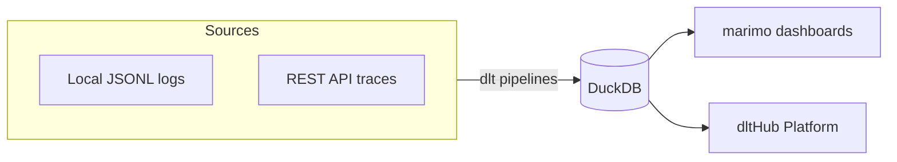

# dlt Workshop — Agent Logs Pipeline & Dashboard

> Source: [DataTalksClub/llm-zoomcamp — cohorts/2026/workshops/dlt/lessons](https://github.com/DataTalksClub/llm-zoomcamp/tree/main/cohorts/2026/workshops/dlt/lessons)
> Workshop taught by **Alena Astrakhantseva** (dltHub).

This workshop builds a data pipeline that turns coding-agent session logs
(Claude Code, Codex, Copilot) into structured tables and dashboards, using
**dlt** and the **dltHub AI workbench** — a setup where a coding agent writes
the pipeline for you from natural-language prompts.

## What you'll build

1. A dlt pipeline loading local Claude Code logs into DuckDB.
2. A marimo dashboard over that data — activity, models, tokens, projects.
3. A REST API pipeline pulling agent traces from a hosted API.
4. A scheduled deployment on the dltHub Platform with a shareable dashboard.



## Table of contents

1. [Overview and setup](#1-overview-and-setup)
2. [Local logs to pipeline](#2-local-logs-to-pipeline)
3. [Debug and build a dashboard](#3-debug-and-build-a-dashboard)
4. [Ingest from a hosted API](#4-ingest-from-a-hosted-api)
5. [Deploy to the cloud](#5-deploy-to-the-cloud)
6. [Deploy the dashboard and schedule](#6-deploy-the-dashboard-and-schedule)
7. [Next steps and recap](#7-next-steps-and-recap)

---

## 1. Overview and setup

Every time you use a coding agent like Claude Code, Codex, or Copilot, it
stores metadata about every session on your laptop. The logs live in places
like `~/.claude/projects/` as JSONL files, one JSON object per line. They
contain usage data, token counts, model names, tool calls — valuable data
trapped in an awkward nested format.

This workshop turns those logs into structured tables and dashboards with
dlt and the dltHub AI workbench, which lets a coding agent build pipelines
from natural-language prompts.

### Prerequisites

- Python 3.11 or later
- [uv](https://docs.astral.sh/uv/) package manager
- A coding agent: Claude Code, Codex, or Copilot
- A dltHub Platform account (free): [app.dlthub.com](https://app.dlthub.com/)
- Some local agent logs so `~/.claude/projects/` has JSONL files to load
  (use your agent for a bit first if you don't have any yet)

### Scaffold the workspace

The dltHub AI workbench has its own scaffolding command — run it in an
empty folder:

```bash
uvx dlthub-init@latest
```

This creates a workspace with `pyproject.toml`, a `.dlt/` config directory,
`.claude/` skills, and `.mcp.json` for the MCP server. It also creates
`__deployment__.py` for cloud deployment and a virtual environment.

When it asks to create a virtual environment and install dependencies, say
yes — it runs `uv sync` for you.

### Open the workspace in your agent

Open the scaffolded folder in your coding agent. The agent reads the
router skill and dispatches to the right toolkit when you ask it to build
a pipeline.

Confirm the workbench is running:

```bash
uv run dlthub ai status
```

DuckDB is our destination for local development — an in-process analytical
database with no server to run. dlt writes to a `.duckdb` file on disk, and
no extra setup is needed since DuckDB ships as a dependency of dlt.

---

## 2. Local logs to pipeline

With the workspace scaffolded, we build a dlt pipeline that reads the JSONL
session transcripts from `~/.claude/projects/` and loads them into DuckDB.
We don't write the code by hand — we tell the agent what to build, and it
uses the dltHub AI workbench to write the pipeline.

### Look at the raw logs

Open `~/.claude/projects/` and pick a `.jsonl` file. Every session is one
file with one JSON object per line. The `type` values vary across lines,
some common ones being `user`, `assistant`, `attachment`, and
`file-history-snapshot`. The data is deeply nested, with usage objects
holding token counts and message objects holding content arrays — real,
valuable data trapped in a format that's painful to query manually.

### Build the pipeline

Tell the agent to build a dlt pipeline for the local logs:

> build a dlt pipeline, load data from local Claude logs as raw JSONs into
> DuckDB

The agent starts with the dltHub router skill, which figures out the data
lives in files on disk. It installs the **filesystem-pipeline** toolkit on
demand — this toolkit didn't exist in the project when you started; the
router pulls it in based on the data source.

The toolkit walks the agent through the standard workflow: confirm the
plan → scaffold the pipeline → configure credentials → run it.

### The pipeline the agent builds

The pipeline uses dlt's `filesystem` source with the `read_jsonl` reader.
The source lists files matching a glob, and the reader opens each one and
yields parsed JSON records. dlt connects them with the pipe operator:

```python
from dlt.sources.filesystem import filesystem, read_jsonl

reader = (
    filesystem(file_glob="**/*.jsonl")
    | read_jsonl()
).with_name("messages")
```

The full pipeline (`code/filesystem_pipeline.py`) defines a `load` function
that creates the pipeline and runs it:

```python
pipeline = dlt.pipeline(
    pipeline_name="agent_logs",
    destination="duckdb",
    dataset_name="agent_logs",
    dev_mode=True,
)
load_info = pipeline.run(reader, write_disposition="replace")
```

A few things to notice:

- `dev_mode=True` adds a timestamp to the dataset name on every run, so
  each run starts fresh. Convenient during development, wasteful in
  production — we'll switch it off later.
- `write_disposition="replace"` drops and reloads the table each time.

### Normalization: 78 tables

When the pipeline runs, dlt doesn't just dump the raw JSON into one table.
It normalizes the data by inferring types, flattening nested objects, and
creating child tables for nested arrays, linked by `_dlt_id` and
`_dlt_parent_id`.

The first run created **78 tables**. The agent logs are heavily nested, so
dlt unnested every array into its own child table. That's correct
behavior, but 78 tables is a lot to work with — fixed in the next step.

### View the data locally

dlt ships with a built-in dashboard. Run it from the command line, not
from the agent session. Make sure your pipeline ran successfully first:

```bash
uv run dlthub local show
```

This opens a marimo dashboard that reads from the local DuckDB file. You
can browse the schema, see how many tables exist, look at the data in
each table, and run SQL queries — this is where you validate that the
pipeline loaded what you expected.

---

## 3. Debug and build a dashboard

The pipeline runs and loads data, but it created 78 tables. Before we
build a dashboard, we want to make sure the pipeline is correct and the
schema is manageable.

### Debug the pipeline

The agent already ran the pipeline and it works, but we want to be
explicit. Tell the agent:

> debug my pipeline

The agent finds the debug-pipeline skill in the rest-api-pipeline toolkit
and installs it. Debugging means the agent runs the pipeline, inspects the
trace, checks for errors, and fixes them until it works.

As Alena explains in the workshop, debugging makes sure the pipeline
doesn't fail and loads some data — but it can't tell you whether the data
is *correct*. That's a judgment only you can make by looking at the
output.

### Schema pollution fix

During debugging, the agent noticed that 78 tables was excessive. It
identified this as **schema pollution** — the deeply nested JSON was
exploding into too many child tables.

The agent fixed it by setting some columns to the JSON data type instead
of unnesting them into child tables. Not all data was unnested. Instead
of 78 tables, the pipeline now creates 40. The deeply nested fields stay
as JSON columns you can query later with DuckDB's JSON functions.

### Build a marimo report

Now that the pipeline is clean, tell the agent to build a dashboard:

> build a marimo report with detailed information about my Claude Code
> usage

The agent installs the **data-exploration** toolkit, which contains
skills for profiling data, planning charts, and assembling marimo
notebooks.

First the agent profiles the data: row counts, schemas, column stats. It
writes an analysis plan — a markdown file listing the questions to
answer, the SQL queries, and the Altair chart code for each one. Then it
assembles the notebook.

### marimo reactive notebooks

marimo is a reactive Python notebook. Every notebook is a plain Python
script, not a JSON blob. Each cell is a Python function — when you change
a cell, every cell that depends on it re-runs automatically.

Unlike Jupyter, you can't run cells in random order, so there's always a
defined order, which prevents variable mix-ups. This strictness makes
marimo better for dashboards, because the state is always consistent.

The dashboard (`code/claude_logs_dashboard.py`) connects to the pipeline
and queries the data with SQL:

```python
pipeline = dlt.attach("agent_logs")
dataset = pipeline.dataset()

df = dataset("""
    SELECT agent, COUNT(*) AS records
    FROM log_records
    GROUP BY 1
    ORDER BY records DESC
""").df()
```

Each chart is a data cell that runs SQL and returns a DataFrame, paired
with a chart cell that builds an Altair visualization:

```python
chart = alt.Chart(df).mark_bar().encode(
    x=alt.X("agent:N", sort="-y"),
    y="records:Q",
    color="agent:N",
    tooltip=["agent:N", "records:Q"],
).properties(title="Total Log Records by Agent")
```

The dashboard shows activity over time, messages by type, models, token
usage, and top projects. In the live session, Alena could see her
vacation week as a gap in activity — Opus was her most-used model.

Run the dashboard:

```bash
uv run marimo edit code/claude_logs_dashboard.py
```

---

## 4. Ingest from a hosted API

Part 1 loaded local logs from disk. But in a real organization, your
agents run in the cloud and their logs live behind an API — think
Logfire, Langfuse, Datadog, or the Anthropic API. You can't read files
from disk; you have to request the data over HTTP.

For this workshop, Alena built a test API that serves one million fake
Claude Code traces in the same structure as real logs. No authentication
is required, and the data is safe to share. The base URL is:

```text
https://test-agent-traces-api-xt2e7ottma-ew.a.run.app
```

### Cloud loggers

When you build an agent, its logs live in a cloud logger. Services like
Logfire and Langfuse collect metadata similar to the local Claude traces:
usage, models, tool calls, skills used. To analyze this data, you request
it through the logger's REST API and load it into a database.

Each logger produces a different trace format with different keys,
different nesting, different field order — always a problem when you have
several agents. dlt handles the normalization for you.

### Build the pipeline

Continue working in the same repo and tell the agent:

> build a dlt pipeline for
> https://test-agent-traces-api-xt2e7ottma-ew.a.run.app/docs, for /logs
> endpoint, load 20k logs into DuckDB, and build a similar marimo report

The agent installs the **rest-api-pipeline** toolkit, which contains
skills for creating pipelines, debugging, exploring data, and applying
incremental loading.

The agent inspects the OpenAPI spec at the `/docs` URL, figures out the
base URL, the pagination type, and the data selector, and writes the
pipeline. If you've ever built a data pipeline against an API by hand,
you know how much work this saves — you need to know how to request the
data, how to paginate, and what the output looks like.

### The REST API source

The pipeline (`code/rest_api_pipeline.py`) describes the API as a config
dictionary:

```python
config: RESTAPIConfig = {
    "client": {
        "base_url": base_url,
        "paginator": {
            "type": "offset",
            "limit": page_size,
            "offset": 0,
            "limit_param": "limit",
            "offset_param": "offset",
            "total_path": "total",
        },
    },
    "resources": [
        {
            "name": "logs",
            "endpoint": {
                "path": "/logs",
                "data_selector": "logs",
            },
            "primary_key": "index",
        },
    ],
}
```

The `data_selector` tells dlt that the records live under the `logs` key
in the response envelope, not at the top level. The paginator uses
offset-based pagination: each request sends `limit` and `offset` query
params, and dlt reads the total count from the `total` key to know when
to stop. A `maximum_offset` of 20000 caps the load at 20k rows without
you hand-rolling pagination loops.

### Run it

Run the pipeline with a sample first, then a full load:

```bash
uv run python code/rest_api_pipeline.py          # one page, 1000 records
uv run python code/rest_api_pipeline.py --full   # all 1 million records
```

The same normalization happens: dlt infers types, flattens nested objects
like `message.content` into child tables linked by `_dlt_parent_id`. The
nested `usage` object becomes columns like `usage__output_tokens` with
double-underscore separators.

---

## 5. Deploy to the cloud

Both pipelines work locally, but you can't share local dashboards with
your team. The dltHub Platform lets you deploy pipelines and dashboards
to the cloud, schedule them, and share them with colleagues.

### Log in

Connect your local workspace to the dltHub Platform:

```bash
uv run dlthub login              # device-code OAuth in the browser
uv run dlthub workspace connect  # pick or create a workspace
```

After connecting, open the platform UI:

```bash
uv run dlthub show
```

Every new account has a playground workspace. Your local workspace
connects to it automatically, so anything you run locally syncs to the
platform.

### Deploy the pipeline

Tell the agent to deploy the REST API pipeline:

> deploy this on the dlthub platform, use duckdb as destination

The agent installs the **dlthub-platform** toolkit. It goes through a
five-step checklist before deploying, then registers the pipeline in
`__deployment__.py` and deploys it.

You can also do it manually:

```bash
uv run dlthub deploy   # ship the current project as a new version
uv run dlthub run      # run the pipeline on the cloud
```

Repeat this deploy-and-run cycle after every code change so the cloud
always reflects your latest version.

### Ephemeral storage

When you deploy with DuckDB as the destination, the data goes to
ephemeral storage. The platform runs your pipeline in a container, and
when the job finishes, the local files are removed — the data doesn't
persist across runs.

### Switch to the Playground destination

To persist data, switch from `duckdb` to the `playground` destination,
a managed S3 lake that keeps data across runs.

In `rest_api_pipeline.py`, change the destination:

```python
# was:
#   destination="duckdb"
# now:
destination="playground"
```

The playground destination requires the `deltalake` package, so after
changing the destination, redeploy and run it:

```bash
uv run dlthub deploy
uv run dlthub run
```

If the run fails because `deltalake` is missing, the deploy step adds the
dependency to `pyproject.toml` automatically — redeploy and run again.

---

## 6. Deploy the dashboard and schedule

The pipeline is deployed and writing to the playground lake. Now we
deploy the marimo dashboard alongside it and set up a schedule.

### Add the dashboard to the deployment

Import the dashboard module in `__deployment__.py` and add it to
`__all__`:

```python
from agent_traces_dashboard import app as agent_traces_dashboard
```

This registers the dashboard as an interactive job. The platform can run
pipelines and interactive applications like marimo notebooks or Streamlit
apps.

The dashboard also needs to point at the playground destination, not
DuckDB. Update the connection:

```python
dlt.attach("agent_traces", destination="playground", dataset_name="agent_logs")
```

> When deploying notebooks, you must pass `destination` and
> `dataset_name` explicitly to `dlt.attach()`.

Deploy and run:

```bash
uv run dlthub deploy
uv run dlthub run
```

### Run mode

Open the notebook in the platform UI. It runs in run mode, not edit
mode, so all the code is hidden and you see only the reports and
visuals — this is the view you share with your team.

The data lives in the playground destination. It could just as well be
MotherDuck, BigQuery, Snowflake, or a vector database like LanceDB — dlt
writes to all of them with the same pipeline code.

### Share it

Publish the dashboard to get a public URL:

```bash
uv run dlthub job publish agent_traces_dashboard
```

Or share it within the workspace via the platform's Users and Roles.

### Scheduling

To keep the data fresh, schedule the pipeline to run on a cron trigger.
Add it to the decorator in `__deployment__.py`:

```python
from dlt.hub.run import trigger

@run.pipeline("agent_traces", trigger=trigger.schedule("0 12 * * *"))
def ingest_agent_logs(): ...
```

Confirm the schedule:

```bash
uv run dlthub job list
```

You can also create followup chains: run the ingestion pipeline, and on
success, run the dashboard to refresh the report. The platform supports
`job.success` triggers that chain jobs together.

You can manage jobs from the platform UI too — start runs, cancel runs,
and manage schedules.

---

## 7. Next steps and recap

### Recap

We built two dlt pipelines and two dashboards, then deployed them to the
cloud:

- A filesystem pipeline loading local Claude Code logs into DuckDB
- A marimo dashboard over that data
- A REST API pipeline pulling traces from a hosted API
- A scheduled deployment on the dltHub Platform with a shareable
  dashboard

You described what you wanted in plain English, and the coding agent used
the dltHub AI workbench to write the pipelines. The workbench's toolkits,
skills, and MCP tools handled the dlt-specific knowledge so you didn't
have to.

### Incremental loading

Both pipelines use `write_disposition="replace"` with `dev_mode=True`,
which means they drop and reload everything on each run. That's fine for
development but doesn't scale once you have millions of rows.

dlt tracks the last loaded value of a cursor column and uses it as a
filter on subsequent runs. The cursor is stored in pipeline state, so it
persists across runs.

For the filesystem pipeline, filter by file modification date:

```python
files = filesystem(
    bucket_url="...",
    file_glob="...",
    incremental=dlt.sources.incremental("modification_date"),
)
```

For the REST API pipeline, use a sequential id:

```python
"resources": [
    {
        "name": "logs",
        "endpoint": {"path": "/logs", "data_selector": "logs"},
        "primary_key": "index",
        "incremental": dlt.sources.incremental("index"),
    },
]
```

Switch `write_disposition` to `"merge"` so existing rows are updated and
new rows are inserted, without dropping anything. Remove `dev_mode` from
the pipeline so data persists.

### Other sources

dlt has many built-in sources beyond filesystem and REST API:

- `sql_database` — incremental loads from Postgres, MySQL, and others
- `google_sheets` — pull data straight from a spreadsheet
- `notion` — load Notion pages and databases
- `hubspot`, `salesforce`, `stripe` — vendor-specific sources with auth
  handled for you

The workflow is always the same: configure the source, create a
pipeline, run it.

### Other destinations

The same pipeline code works with Postgres, BigQuery, Snowflake, and
Redshift. Only the destination string and credentials change.

### Key concepts

Here's where each concept showed up in the workshop:

| Concept | Where it showed up |
|---|---|
| Toolkits | filesystem, rest-api, data-exploration, dlthub-platform — installed on demand, each a guided workflow |
| MCP tools | look at pipelines, schemas, row counts, and previews |
| dlt normalization | nested JSON becomes typed tables and child tables |
| REST API source | offset pagination, `data_selector`, `maximum_offset` |
| Named destinations | `playground` is duckdb for dev or S3 lake for prod, one code path |
| marimo | reactive notebooks with SQL-first data cells and altair chart cells |
| Scheduling and triggers | cron `schedule` and `job.success` followup chains, declared in decorators |

### Artifacts you produced

```text
filesystem_pipeline.py              # Part 1: local Claude logs -> DuckDB
claude_logs_dashboard.py            # Part 1: usage report
rest_api_pipeline.py                # Part 2: agent_traces API -> lake
agent_traces_dashboard.py           # Part 2: agent_traces report
__deployment__.py                   # deployment manifest (jobs + triggers)
```

### To learn more

- [dlt documentation](https://dlthub.com/docs) — the full reference
- [dltHub AI workbench](https://dlthub.com/docs/dlt-ecosystem/llm-tooling/llm-native-workflow) — toolkits, skills, and the MCP server
- [Deploy and schedule on the runtime](https://dlthub.com/docs/hub/getting-started/runtime-tutorial) — jobs, schedules, triggers
- [marimo documentation](https://docs.marimo.io) — reactive notebooks
- [Altair encodings](https://altair-viz.github.io/user_guide/encodings/channels.html)
