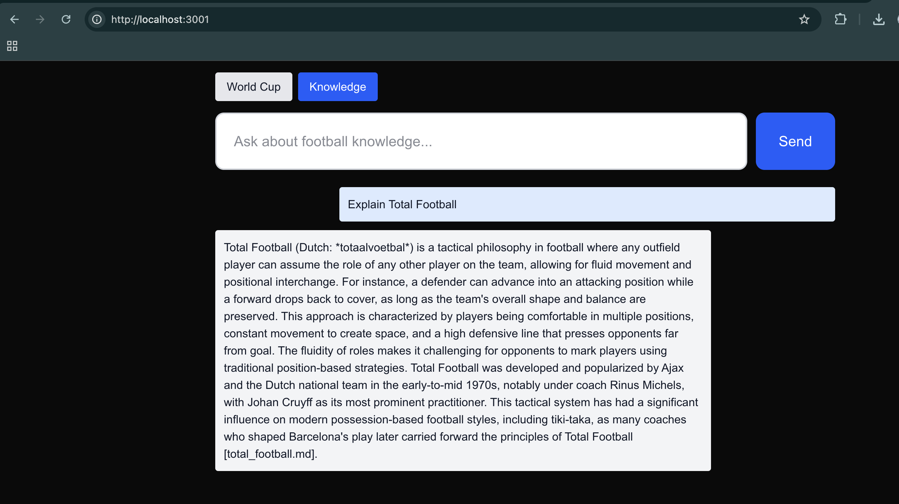

# Phase 1 build order
For a working end-to-end slice, I'd build in this order — data first, then reasoning, then API, then UI, then eval, then containers:

1. Environment & config — API keys needed (OpenAI, football-data.org), .env structure, local Qdrant running
2. Shared Tool Layer stubs — wrapper functions for football-data.org (get_live_matches, get_standings, get_schedule) so agents have real data to call
3. Knowledge base ingestion — collect Tactical Concepts + World Cup History content, chunk it, embed with text-embedding-3-small, load into Qdrant
4. LangGraph agent graph — Section Match Check (router) + World Cup Agent + Knowledge Agent as graph nodes
5. FastAPI backend — /chat endpoint streaming via SSE, wired to the LangGraph graph
6. Next.js frontend — chat UI with section picker, connected to the streaming endpoint
7. Evaluation — ground-truth Q&A set, retrieval metrics, LLM-as-judge script
8. Docker Compose — containerize backend, frontend, Qdrant; instructions to run locally

# TODO

- Scaffold backend/frontend repo structure
- Draft requirements.txt and .env.example
- Get football-data.org API key and verify access
- Build football_api.py tools with rate-limit-aware requests
- Build knowledge base ingestion (chunk + embed + load into Qdrant)
- Build RAG search tool (query-time retrieval from Qdrant)
- Build LangGraph agent graph (router + World Cup + Knowledge agents)
- Build FastAPI backend with SSE streaming /chat endpoint
- Build Next.js chat UI with section picker
- Build evaluation pipeline (ground truth, retrieval metrics, LLM-as-judge)
- Write Docker Compose setup for full stack
- Test full backend pipeline end-to-end

# Repo structure

```
capstone/
├── backend/
│   ├── app/
│   │   ├── main.py              # FastAPI app entrypoint — creates the app, registers the /chat route
│   │   ├── config.py            # Reads .env values (API keys, Qdrant URL) into one place
│   │   ├── agents/
│   │   │   ├── graph.py         # The LangGraph StateGraph — wires router + agents together (deep dive when we get here)
│   │   │   ├── router.py        # Section Match Check logic
│   │   │   ├── world_cup_agent.py
│   │   │   └── knowledge_agent.py
│   │   ├── tools/
│   │   │   ├── football_api.py  # get_live_matches(), get_standings(), get_schedule() — wraps football-data.org
│   │   │   └── rag_search.py    # search_rag() — queries Qdrant
│   │   └── ingestion/
│   │       └── load_knowledge_base.py  # one-off script: chunk docs → embed → upload to Qdrant
│   ├── tests/
│   ├── requirements.txt
│   └── Dockerfile
├── frontend/
│   ├── app/                     # Next.js pages (chat UI, section picker)
│   ├── components/
│   ├── package.json
│   └── Dockerfile
├── data/
│   └── knowledge_base/          # raw source docs for Tactical Concepts + World Cup History (before ingestion)
├── eval/
│   ├── ground_truth.jsonl       # your ~30-50 Q&A pairs
│   └── run_eval.py
├── docker-compose.yml           # backend + frontend + qdrant, one command to run everything
├── .env.example                 # documents required keys without committing real secrets
├── PHASE_0.md
└── PHASE_1.md
```

```shell
# --- Backend structure ---
mkdir -p backend/app/agents backend/app/tools backend/app/ingestion backend/tests

touch backend/app/__init__.py \
      backend/app/main.py \
      backend/app/config.py \
      backend/app/agents/__init__.py \
      backend/app/agents/graph.py \
      backend/app/agents/router.py \
      backend/app/agents/world_cup_agent.py \
      backend/app/agents/knowledge_agent.py \
      backend/app/tools/__init__.py \
      backend/app/tools/football_api.py \
      backend/app/tools/rag_search.py \
      backend/app/ingestion/__init__.py \
      backend/app/ingestion/load_knowledge_base.py \
      backend/requirements.txt \
      backend/Dockerfile

# --- Data + eval ---
mkdir -p data/knowledge_base eval

touch eval/ground_truth.jsonl \
      eval/run_eval.py


# --- Data + eval ---
mkdir -p data/knowledge_base eval

touch eval/ground_truth.jsonl \
      eval/run_eval.py

# --- Root config files ---
touch docker-compose.yml .env.example

# --- Frontend: use the real Next.js scaffolder, not mkdir ---
npx create-next-app@latest frontend
```


- `agents/` vs `tools/` is the most important separation to understand, and it's actually a LangGraph-relevant idea: agents decide what to do (reasoning), tools are the plain Python functions that actually go fetch data or query Qdrant. In Kestra terms, think of `tools/` as your task definitions (the actual work — an HTTP call, a DB query) and `agents/` as the flow logic that decides which tasks to call and in what order. When we build graph.py, you'll see this split matters a lot — LangGraph nodes call tools, they don't do I/O directly.
- `ingestion/` is separate from `tools/` because ingestion (loading the knowledge base into Qdrant) is a one-time/occasional batch job, not something that runs on every user request — different lifecycle, so it doesn't belong next to the request-time RAG search code.
- `data/knowledge_base/` holds the raw source material before it's chunked/embedded — keeping raw sources on disk (not just in Qdrant) means you can always re-run ingestion if you change your chunking strategy later.
- `eval/` is top-level, not inside backend/` because it tests the whole system's output quality, not just backend code — conceptually closer to a QA suite than application code.
- Backend and frontend each get their own `Dockerfile` because they're different runtimes (Python vs Node) — `docker-compose.yml` at the root then just wires the two together plus Qdrant.

# Step: Football Data Tools (tools/football_api.py)

Prerequisite: sign up for a free key at football-data.org — you'll get an API token via email, no payment info needed.

Key facts about this API you need to design around:

- Auth is a header: `X-Auth-Token: <your key>` on every request (not a query param, not OAuth — the simplest kind of auth).
- Base URL: https://api.football-data.org/v4/
- Free tier is rate-limited to 10 requests/minute. This matters for design: if your World Cup Agent calls this on every single user message, you'll hit the limit fast during testing/demo. We'll want a small in-memory cache (even a simple "don't refetch standings more than once every 60 seconds" check) later — noting it now, not building it yet, so it doesn't get forgotten.
- Relevant endpoints for Phase 1:
    - `/v4/competitions/{id}/standings` — league table
    - `/v4/competitions/{id}/matches` — fixtures/results (filter with `dateFrom/dateTo` for "who plays today")
    - World Cup competition code is `WC`

## Design decisions, explained:

1. Plain Python functions, not LangGraph tools yet. These functions just do HTTP calls and return data — no framework-specific code. In the agent graph step, we'll wrap each one with LangChain's `@tool` decorator so a LangGraph agent can call it. Keeping them plain now means you can test them directly (`python -c "print(get_standings())"`) without needing any agent machinery running — much faster feedback loop while debugging the API integration itself.
2. `async` functions using `httpx`, not `requests`. Your FastAPI backend is async end-to-end (that's what makes SSE streaming work smoothly), so tools that block on network I/O should be async too — otherwise a slow football-data.org response would stall your whole server, not just that one request.
3. One shared helper (`_get`) for the auth header, so each public function doesn't repeat the same header/error-handling code — three functions is exactly the point where a tiny shared helper earns its keep, not before.

# Get Football data API key

1. Go to football-data.org and register for a free account (Account → Register). No credit card needed.
2. Confirm your email if prompted.
3. Once logged in, your account dashboard shows your API Token — that's the value for `FOOTBALL_DATA_API_KEY`.
4. Paste it into your actual .env file (not `.env.example` — that one stays a template with blank values). Since `.env` is gitignored, it's safe to put the real key there.

## Test key
```bash
curl -H "X-Auth-Token: YOUR_KEY_HERE" https://api.football-data.org/v4/competitions/WC/standings
```

# LangGraph core concepts, mapped to Kestra

| **Kestra** | **LangGraph** | **What it means here** |
|------------|---------------|-------------------------|
| A flow's execution context / variables passed between tasks | **State (a TypedDict)** | One shared data structure (e.g., `question`, `section`, `answer`) that every node reads from and writes to. |
| A task in a YAML flow | **A node (a Python function)** | `check_section_match`, `world_cup_agent_node`, and `knowledge_agent_node` are our three "tasks". |
| `depends_on` between tasks | **An edge** | Defines which node runs after another. |
| An `if`/`switch` task branching to different downstream tasks | **A conditional edge (`add_conditional_edges`)** | After the router runs, branch to the World Cup agent, Knowledge agent, or stop based on a routing function you define. |
| The flow's implicit start/end | **`START` / `END`** | Explicit sentinel nodes that you connect yourself. |
| YAML flow definition, validated at deploy | **`StateGraph(...).compile()`** | You build the graph in Python, then call `.compile()` to validate it (ensuring all nodes and edges are valid) and produce a runnable workflow. |

One more LangGraph-specific rule worth knowing upfront: a node function never mutates state directly — it returns a dict of only the fields that changed, and LangGraph merges that back into the shared state for you. You'll see this in every node below (return {"answer": ...}, not state["answer"] = ...).

# Building the FastAPI backend — 

This is also where our earlier SSE decision actually gets implemented, and where streaming meets the LangGraph graph for the first time.

One design decision worth explaining before the code: how do we stream anything from a graph, not just a single LLM call? LangGraph's compiled graph has an .astream_events() method that emits fine-grained events as it runs — including on_chat_model_stream events with each token the moment an LLM inside a node generates it. We filter those events down to just the ones we want to show the user.

There's one wrinkle: the router's LLM call uses with_structured_output() (function-calling under the hood, not free text), so it doesn't produce clean streamable text — only the two agent nodes do. So the logic is: stream tokens live from the agent nodes, but if the router rejects the section, send its ready-made mismatch message as one complete event instead (there's nothing to stream token-by-token there anyway).

# Build Next.js chat UI with section picker
One important gotcha to explain before the code: our backend streams via POST with a JSON body, but the browser's native EventSource API (the usual way to consume SSE) only supports GET requests — it can't send a POST body. So we can't use EventSource here; instead we use fetch() and manually read the streaming response body chunk by chunk, parsing the event:/data: lines ourselves. More code than EventSource, but it's the correct approach for a POST-based stream like ours.

# Knowledge base
Once static files are saved, running from inside `backend/` command  `python -m app.ingestion.load_knowledge_base` should pick them up. Basiaclly ingestion script will automatically find and read those files.

Note - Run `pip install -r requirements.txt` in virtual envt before running knowledge base.

## Output
```bash
backend % python -m app.ingestion.load_knowledge_base
Loaded 3 source documents
Split into 6 chunks
Generated embeddings for all chunks
Uploaded 6 chunks to Qdrant collection 'soccermind_knowledge'
```

## Ingestion is fully working — 3 documents, 6 chunks, embedded and uploaded to Qdrant. That's the knowledge base built.

# End to end testing of phase 1 through UI
Need three things running at once, each in its own terminal tab:

## 1. Terminal 1 — Qdrant (should already be running from before):

Runnig via docker - `docker compose up --build`

```bash
backend % docker ps   # confirm the qdrant container is still up

CONTAINER ID   IMAGE               COMMAND                  CREATED       STATUS       PORTS                                                             NAMES
2e678d1d7bdf   capstone-frontend   "docker-entrypoint.s…"   2 hours ago   Up 2 hours   0.0.0.0:3000->3000/tcp, [::]:3000->3000/tcp                       capstone-frontend-1
71fd05261c98   capstone-backend    "uvicorn app.main:ap…"   2 hours ago   Up 2 hours   0.0.0.0:8000->8000/tcp, [::]:8000->8000/tcp                       capstone-backend-1
da0b5ed0fd5f   qdrant/qdrant       "./entrypoint.sh"        2 hours ago   Up 2 hours   0.0.0.0:6333-6334->6333-6334/tcp, [::]:6333-6334->6333-6334/tcp   capstone-qdrant-1
```

## Terminal 2 — Backend:

```bash
cd backend
source .venv/bin/activate
uvicorn app.main:app --reload --port 8000

# Output
backend % uvicorn app.main:app --reload --port 8000
INFO:     Will watch for changes in these directories: ['/Users/niteshmishra/LLM_Zoomcamp_new/LLM_Zoomcamp/capstone/backend']
INFO:     Uvicorn running on http://127.0.0.1:8000 (Press CTRL+C to quit)
INFO:     Started reloader process [69997] using WatchFiles
INFO:     Started server process [70005]
INFO:     Waiting for application startup.
INFO:     Application startup complete.
```

## Terminal 3 — Frontend:

```bash
cd frontend
npm run dev

# Output
frontend % npm run dev

> frontend@0.1.0 dev
> next dev

⚠ Port 3000 is in use by process 2727, using available port 3001 instead.
▲ Next.js 16.2.10 (Turbopack)
- Local:         http://localhost:3001
- Network:       http://192.168.1.153:3001
- Environments: .env.local
✓ Ready in 360ms
```

Then open http://localhost:3001 in your browser, pick the Knowledge section, and try asking something like "Explain Total Football" — that should route through the Section Match Check, hit the Knowledge Agent, retrieve chunks from total_football.md, and stream back an answer.



If you want to test the World Cup section too, try something like "Who won the World Cup in 2026?" — though note that one exercises football_api.py against the live football-data.org API, so it'll also be your first real test of the rate-limit handling we built.


# Evaluation — ground-truth Q&A set, retrieval metrics, LLM-as-judge script

Let's build this as one cohesive piece since retrieval metrics and LLM-as-judge both need the same ground-truth set and reuse the same underlying tools.

Design decision worth explaining upfront: the eval script reuses the actual production knowledge_agent_node function to generate answers, rather than reimplementing the RAG logic separately. This matters — if we wrote a second, slightly different version of the retrieval+prompt logic just for testing, the eval could pass while the real app behaves differently (eval/production drift). Also: I noticed knowledge_agent_node calls search_rag() without a section filter (searches the whole knowledge base, not just one section) — so the eval matches that exact behavior rather than testing a hypothetical filtered version that isn't what actually runs.

## How to test
Activate the venv, make sure Qdrant is up and the knowledge base is ingested, then `python eval/run_eval.py`

## Output
```shell
capstone % python eval/run_eval.py
Loaded 16 ground-truth questions

=== Retrieval Evaluation ===
Hit Rate: 100.00%
MRR:      1.000

=== Answer Quality Evaluation (LLM-as-judge) ===
Avg Relevance:    5.00 / 5
Avg Faithfulness: 5.00 / 5

Per-question results:
- [5/5 rel, 5/5 faith] What is Total Football?
  The answer directly addresses the question about Total Football, accurately summarizing its definition, origins, and key figures, all of which are supported by the provided context.
- [5/5 rel, 5/5 faith] Who popularized Total Football and in what era?
  The answer directly addresses the question by naming Rinus Michels and the era of the early-to-mid 1970s, and it accurately includes Johan Cruyff as a key figure.
- [5/5 rel, 5/5 faith] How did Total Football influence later playing styles?
  The answer directly addresses how Total Football influenced later playing styles, specifically mentioning tiki-taka and the role of Johan Cruyff, which is well-supported by the provided context.
- [5/5 rel, 5/5 faith] What is tiki-taka?
  The answer accurately defines tiki-taka and incorporates key elements from the provided context, demonstrating a clear understanding of the style.
- [5/5 rel, 5/5 faith] What is a false 9 in football?
  The answer directly defines a false 9 and accurately references its role in the tiki-taka system, aligning perfectly with the provided context.
- [5/5 rel, 5/5 faith] What criticism is commonly made of tiki-taka?
  The answer directly addresses the criticism of tiki-taka as being overly cautious and susceptible to low-block defenses, accurately reflecting the provided context.
- [5/5 rel, 5/5 faith] What is gegenpressing?
  The answer directly addresses the question about gegenpressing and accurately reflects the information provided in the context.
- [5/5 rel, 5/5 faith] Which manager is most associated with gegenpressing?
  The answer directly addresses the question by naming Jürgen Klopp as the manager associated with gegenpressing and is fully supported by the provided context.
- [5/5 rel, 5/5 faith] What formation uses wing-backs and has roots in Italian catenaccio?
  The answer directly addresses the question by correctly identifying the 3-5-2 / 5-3-2 formation as using wing-backs and having roots in Italian catenaccio, fully supported by the provided context.
- [5/5 rel, 5/5 faith] How often is the World Cup held?
  The answer directly addresses the frequency of the World Cup and accurately references the context provided.
- [5/5 rel, 5/5 faith] How many teams will play in the 2026 World Cup?
  The answer directly addresses the question about the number of teams in the 2026 World Cup and is fully supported by the provided context.
- [5/5 rel, 5/5 faith] How do national teams qualify for the World Cup?
  The answer directly addresses how national teams qualify for the World Cup and accurately reflects the information provided in the context.
- [5/5 rel, 5/5 faith] Which country has won the most World Cup titles?
  The answer directly addresses the question and is fully supported by the provided context.
- [5/5 rel, 5/5 faith] What happened in the 1986 World Cup quarterfinal between Argentina and England?
  The answer directly addresses the question about the 1986 World Cup quarterfinal and accurately reflects the context provided.
- [5/5 rel, 5/5 faith] What was notable about the 2014 World Cup semifinal?
  The answer directly addresses the question about the notable aspect of the 2014 World Cup semifinal and is fully supported by the provided context.
- [5/5 rel, 5/5 faith] How did Argentina win the 2022 World Cup final?
  The answer directly addresses how Argentina won the final and is fully supported by the provided context.
  ```

# What I Learned (Phase 1)

## LangGraph
- A LangGraph app is built from three things: a **State** (a shared data structure passed between steps), **nodes** (plain functions that read state and return updates), and **edges** (which decide what runs next — including **conditional edges**, which pick the next node based on the current state, similar to a `switch`/`if` step in a workflow tool).
- A node never changes state directly — it returns a dict of only the fields that changed, and LangGraph merges that back in.
- `astream_events()` streams fine-grained events as the graph runs — but it fires events for **everything running inside a node**, not just the node's own final output. I had to explicitly check the event was a plain dict (not a nested LLM call's raw output) before treating it as the node's real result.
- Any code path that returns an answer without calling the LLM (like a router rejecting a question, or a graceful fallback) produces no token-streaming events — the streaming layer needs an explicit way to handle "answer already decided, nothing to stream."

## RAG and Evaluation
- Chunking matters: short, self-contained paragraphs under clear headers retrieve much better than long unstructured text, because a chunk needs to make sense on its own once pulled out of context.
- Retrieval and generation are two separate things that can each fail independently. I measured them separately: **Hit Rate** (did retrieval find the right document at all?) and **MRR** (how high did it rank?) for retrieval, and an **LLM-as-judge** score (relevance + faithfulness) for the generated answer.
- The eval pipeline caught a real bug I didn't notice by testing manually: two knowledge base files had never actually been created, so retrieval silently failed for exactly those topics. The failure pattern (two whole files failing completely, not scattered misses) was the clue — this is why running a systematic eval matters more than spot-checking a few questions by hand.

## Working with a Real, Rate-Limited API
- Free API tiers often have real restrictions you can't discover from documentation alone — football-data.org returns HTTP 403 (not empty data) when asking for a season outside the free plan's coverage. The fix is to catch that specific error and respond honestly, not treat it as an unexpected crash.
- Response headers can tell you your remaining rate-limit quota in real time — checking them proactively (instead of guessing a fixed wait time) is more reliable.

## Prompt Design
- A cheaper/smaller model (`gpt-4o-mini`) can fail to find a fact that's stated clearly in a long prompt, even when it's spelled out multiple ways. I confirmed this by testing the exact same prompt directly in ChatGPT, which got it right — proving the issue was model capability, not the prompt itself.
- Two different fixes for that kind of problem: upgrade to a stronger model, or reduce how much irrelevant data is in the prompt in the first place. Both work; pre-filtering is usually cheaper long-term.
- Don't make the LLM compute something code can compute reliably (like "who won" from a score) — state the answer explicitly and let the LLM explain it, not derive it.

## Debugging Practice
- When a fix "doesn't work," the first thing to check is whether it was actually applied and the server restarted — several bugs in this project were really just a forgotten `docker compose up --build` or a copy-pasted snippet that didn't fully replace the old code.
- Comparing the exact same input against a different, trusted system (like pasting a prompt straight into ChatGPT) is a fast way to tell whether a bug is in your code or in the model's behavior.
