# Phase 2
From PHASE_0.md, Phase 2 scope is: `Club Football Agent`, `Tactical Analyst`, `conversation memory`, and `the auto-routing upgrade` (plus stats visualizations and conversation history in the UI). 

# Build order

1. `Conversation memory first` — this is foundational rather than a new feature bolted on: it changes the shared GraphState and how the graph itself runs (LangGraph's checkpointer system). Building it before the new agents means Club Football Agent and Tactical Analyst get memory "for free" from day one, instead of retrofitting it into three agents later. This is also the next real LangGraph concept from our Kestra mapping — Kestra's execution history ↔ LangGraph's checkpointers — so it's a good next teaching moment too.
2. `Club Football Agent` — most similar to the World Cup Agent we already built (live football-data.org data, possibly a RAG fallback pattern), so it reinforces what you just learned rather than introducing something totally new.
3. `Tactical Analyst` — worth a short design discussion before coding: is this a new dedicated agent (its own section), or a change to how existing agents explain stats? The PHASE_0 description ("explain why, not just show numbers") could go either way architecturally.
4. `Auto-routing upgrade` — replacing the manual section picker with free-text intent detection. This is the biggest UX/architecture change of the four, so I'd tackle it after the new agents exist (more to route between = more meaningful test of whether auto-routing actually works).
5. `Frontend`: stats visualizations + conversation history UI — wire up last, once the backend actually has memory and richer data to show.

# Todos

- Draft Phase 2 flow diagram (Mermaid) - DONE
- Add conversation memory infrastructure (checkpointer, reducer, thread_id) - DONE
- Wire conversation history into agent prompts - DONE
- Build Club Football Agent - DONE
- Design and build Tactical Analyst - DESCOPED
- Build auto-routing upgrade - DONE
- Build frontend: stats visualizations + conversation history UI - DONE

# Phase 2 Flow diagram 

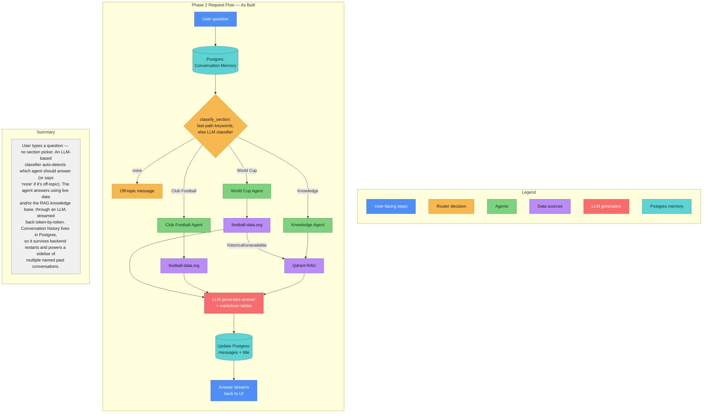


A couple of things this diagram surfaces worth discussing before we build:

- **No more manual section picker** — the whole "user picks a section or types free text" framing is gone; it's auto-routing only now.
- **Router is `classify_section`**, shown as two-stage (deterministic keyword fast-path, LLM classifier as fallback) rather than a generic "section match" box — reflects the real, debugged design.
- **Tactical Analyst is gone entirely** — no "TBD" placeholder, since it was deliberately descoped, not left unbuilt.
- **Club Football Agent has no RAG fallback arrow** — accurate to what was actually built (no club football knowledge base content exists).
- **Memory is explicitly Postgres**, not a generic "Conversation Memory" bubble, and shows both the read (loading history) and write (saving messages + title) sides.
- **LLM node now mentions markdown tables**, since that's a real, distinct part of what the LLM produces now.

# Sidebar Flow
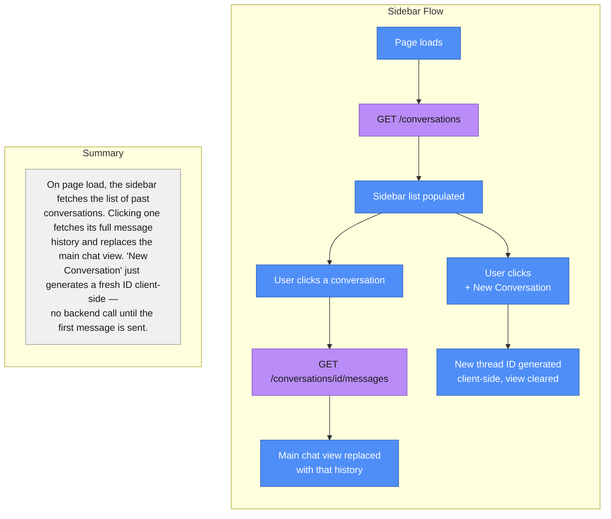


# Add conversation memory infrastructure (checkpointer, reducer, thread_id)

Two new LangGraph concepts here, worth understanding before the code:

1. `Checkpointer` — this is the Kestra "execution history" equivalent we flagged earlier: a component that automatically saves the graph's state after every step, keyed by a thread_id (a conversation/session identifier). When you invoke the graph again with the same thread_id, LangGraph loads the previous state automatically — you don't manually pass the whole conversation history in every request. We'll start with MemorySaver (in-process, resets when the backend restarts) — simplest option for now; a persistent backend like Postgres is a natural later upgrade, not needed yet.

2. `Reducers` — this one's new, no direct Kestra analog. Normally, a node's returned dict replaces the corresponding state field (that's the default merge behavior we've relied on all along). But for conversation history, you don't want each turn to replace the message list — you want it to append. Annotated[list, add_messages] tells LangGraph "use a different merge rule for this field: append, don't overwrite."

`Important scope note`: this pass wires up the infrastructure — messages get recorded and persisted correctly across turns for a given thread_id. The agents don't yet actually read that history when generating answers (that's a deliberate next step, not a bug) — so a follow-up question like "what about the semifinal?" won't yet be understood in context. We'll test memory is being stored correctly first, then wire it into the prompts next.

## Testing

Test whether regular flow from Phase_1 is working or not.

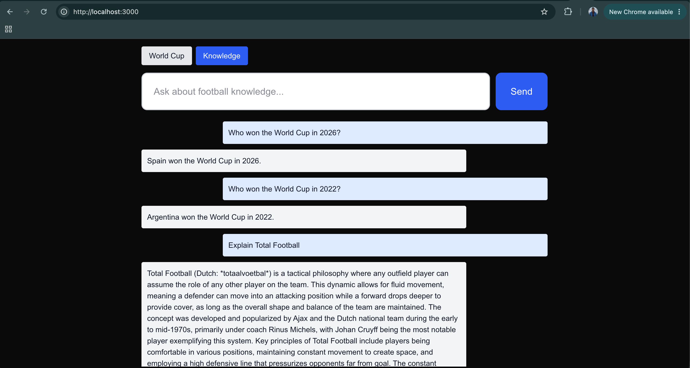

# Wire conversation history into agent prompts

Now for the payoff step — wiring state["messages"] into the actual prompts so follow-up questions work. Here's the design choice worth understanding: instead of building one big text string like we did in Phase 1, we now pass a proper list of messages to the LLM (a SystemMessage with instructions/context + the full conversation history). Chat models like ChatOpenAI are built to consume conversation history this way natively — this is the actual reason we structured state around message objects with add_messages rather than a plain string, so this step is where that design pays off.

One nice detail: state["messages"] already ends with the current question by the time these nodes run (main.py adds it to the input before the graph starts), so [SystemMessage(...)] + state["messages"] is naturally "instructions + context, then the whole conversation including what was just asked" — exactly what a chat model expects.

## Testing

Test this by asking a genuine follow-up — something that only makes sense with context, e.g.:

"Who won the World Cup in 2022?" → Argentina
"How did they get there?" or "Who did they beat in the final?" → should correctly understand "they" refers to Argentina, without you naming the team again

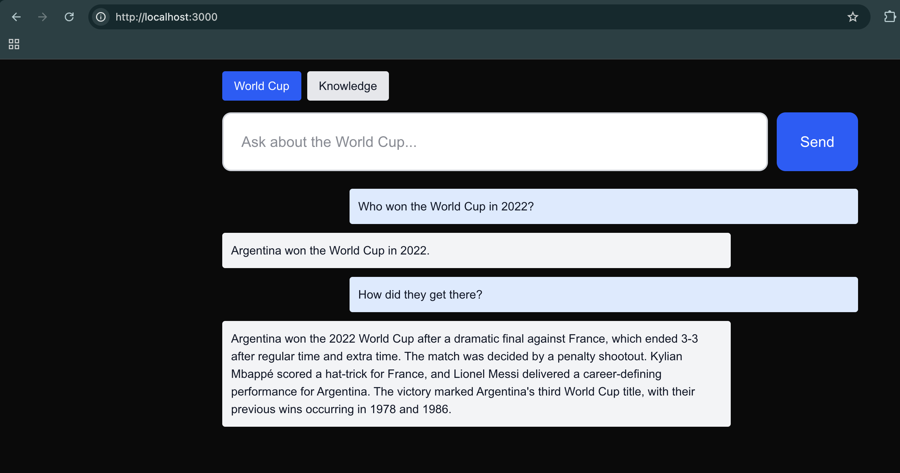

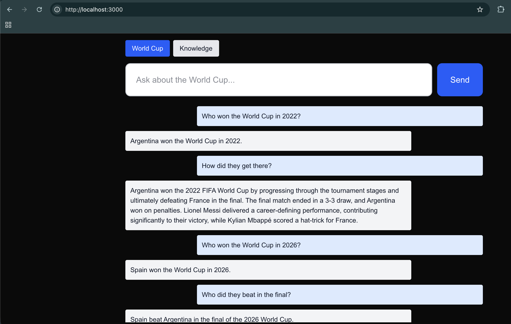

# Build Club Football Agent
since football_api.py's functions already accept any competition_code (not hardcoded to "WC"), Club Football Agent can directly reuse get_standings/get_schedule with a different code. Less new code.

Design decisions worth flagging:

1. League detection via keywords, checking the current question then conversation history (applying the lesson from World Cup Agent proactively this time) — defaults to Premier League if nothing's mentioned, since it's the most commonly asked-about league.
2. No "final match" concept here — unlike the World Cup, league competitions (Premier League, La Liga, etc.) don't have a single final; the champion is whoever tops the standings at season's end. So this agent is simpler than World Cup Agent: standings + recent matches, no separate "who won the final" logic. Champions League does have a knockout final, but I'm keeping this first pass uniform across all six competitions rather than special-casing one — worth revisiting if Champions League questions specifically need that.
3. No RAG fallback for historical seasons — unlike World Cup Agent, our knowledge base has no club football content, so there's nothing to fall back to. A 403 on a historical season gets an honest "I don't have that data" instead.
4. Honesty flag: I haven't verified this endpoint's exact response shape for a league (vs. the World Cup, which we confirmed via curl) — field names like goalsFor/goalsAgainst and the type: "TOTAL" filter (leagues often return separate home/away/overall tables) are my best understanding of football-data.org's conventions, not verified against real data. If you get a KeyError, paste it and we'll fix the specific field.

## Testing
Test with something like "How is Arsenal doing in the Premier League?" or "What are the current La Liga standings?"

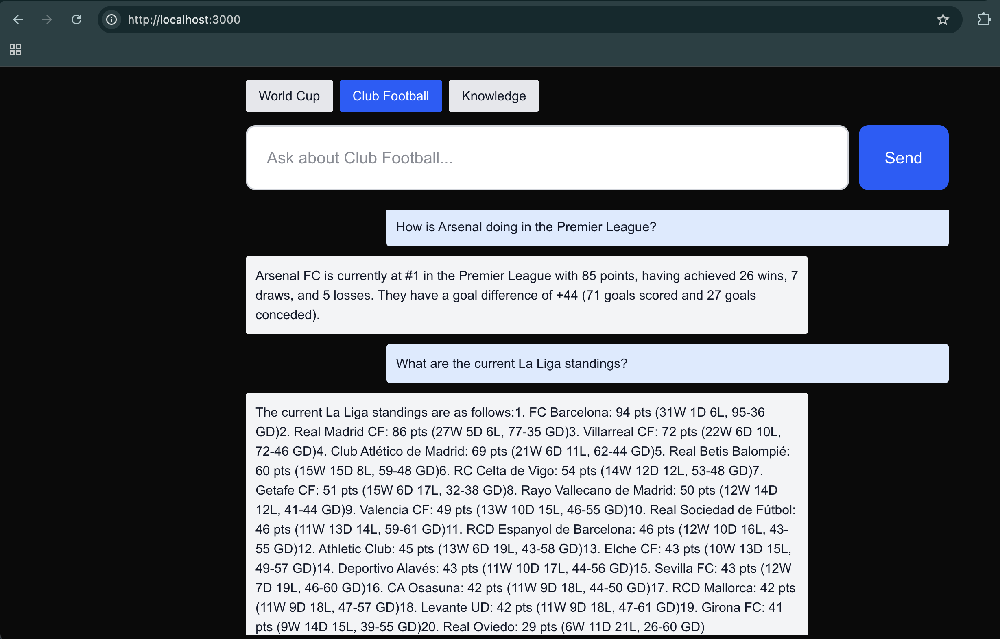

# Design and build Tactical Analyst

## **Tactical Analyst — descoped (2026-07-23):** 
Originally planned as a dedicated agent/section. Design review found the differentiation from Knowledge Agent was too thin once we verified (via direct API testing) that detailed per-match statistic (possession, shots) aren't available on any free tier for historical matches — without that, "tactical analysis" reduced to RAG-over-concepts with a different prompt persona, which didn't justify a separate agent/section/router entry. Folded the "explain why, not just what" framing directly into Knowledge Agent's prompt instead.

# Build auto-routing upgrade 

## What changes conceptually: 
Right now, check_section_match validates a question against a section the user already picked. Auto-routing flips this: there's no pre-picked section anymore, so the router needs to classify the question into one of the sections itself. I'm reusing the exact same deterministic fast-path pattern that proved necessary for reliability (_mentions_world_cup-style keyword matching before falling back to an LLM call) — same lesson, now applied to classification instead of validation.

## What happens to "mismatch"?
There's no "wrong section" anymore since the user isn't picking one — instead there's a new outcome: none, for questions that aren't about football at all (e.g. "what's the weather"). That gets a graceful redirect message instead of the old "pick a different section" message.

## UI change:
The three section buttons go away entirely — just one input box, and the backend figures out which agent should answer. (Optional future polish, not building now: showing which agent actually answered, e.g. a small "via Club Football Agent" label — happy to add that later if you want the transparency.)

## Testing

- "Who won the World Cup in 2022?" → Argentina
- "How did they get there?" or "Who did they beat in the final?" → should correctly understand "they" refers to Argentina, without you naming the team again
- Test with something like "How is Arsenal doing in the Premier League?" or "What are the current La Liga standings?"
- "What are the current Serie A standings?"

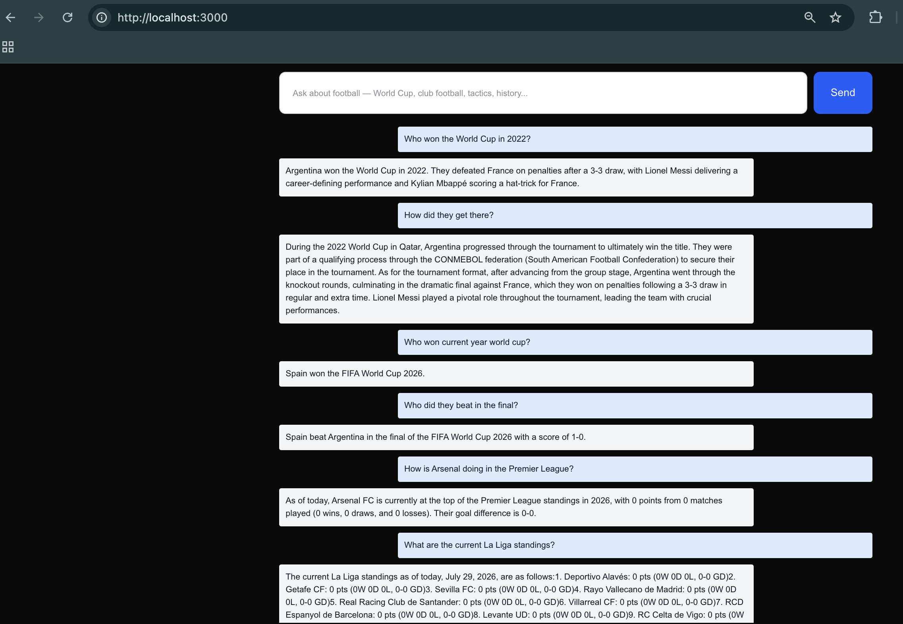

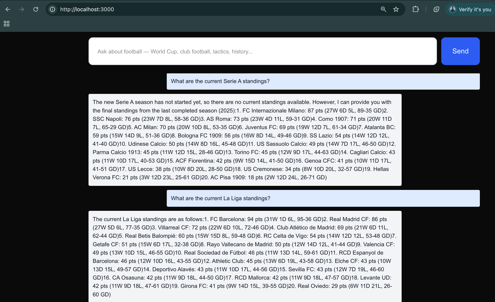

# Build frontend: stats visualizations + conversation history UI

## Stats/structured data in chat - Markdown tables are the baseline 

## Conversation history - Full multi-conversation sidebar (persistent, database-backed) 

Proposed build order:

1. `Markdown tables` — quick, independent win: agent prompts output markdown table syntax, frontend gets a markdown renderer. No architecture changes.
2. `Postgres-backed persistent checkpointer` — swap MemorySaver for LangGraph's PostgresSaver, add a Postgres service to Docker Compose. Get this working and tested before building anything on top of it — conversation memory should behave identically to before, just now surviving backend restarts.
3. `Conversation metadata (titles)` — decide how conversations get named for the sidebar. Simplest approach: title = the first user message (truncated), no extra LLM call needed. (Fancier: an LLM-generated summary title like ChatGPT does — more polish, more cost/complexity. I'd start with the simple version.)
4. `New backend endpoints` — list all conversations, fetch a specific conversation's full message history.
5. `Frontend sidebar` — list conversations, click to switch (loading that conversation's history into the chat view), "new conversation" button.

## 1. Markdown tables
```bash
# Frontend — add a markdown renderer
cd frontend
npm install react-markdown remark-gfm
```

### Testing
- `Test a standings-shaped question` — something guaranteed to produce a table, e.g. "What are the current Premier League standings?" or "How is Arsenal doing?" — check that:
    - The table actually renders as a real HTML table (borders, header row shaded), not raw | Pos | Team | ... | text
    - The data in the table looks correct (positions, points, etc. match what you'd expect)

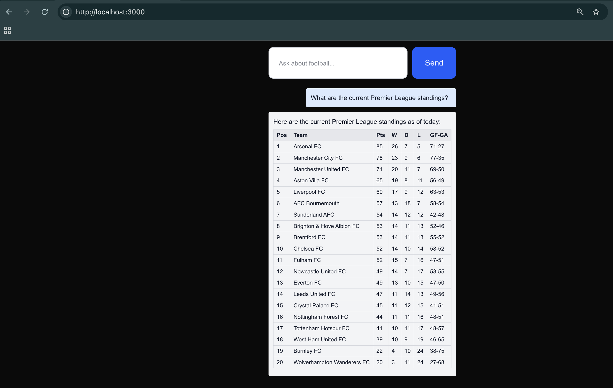

- `Test a non-table question` — e.g. a Knowledge Agent question like "Explain Total Football" — confirm it still displays normally as plain text, nothing broke for non-tabular answers.

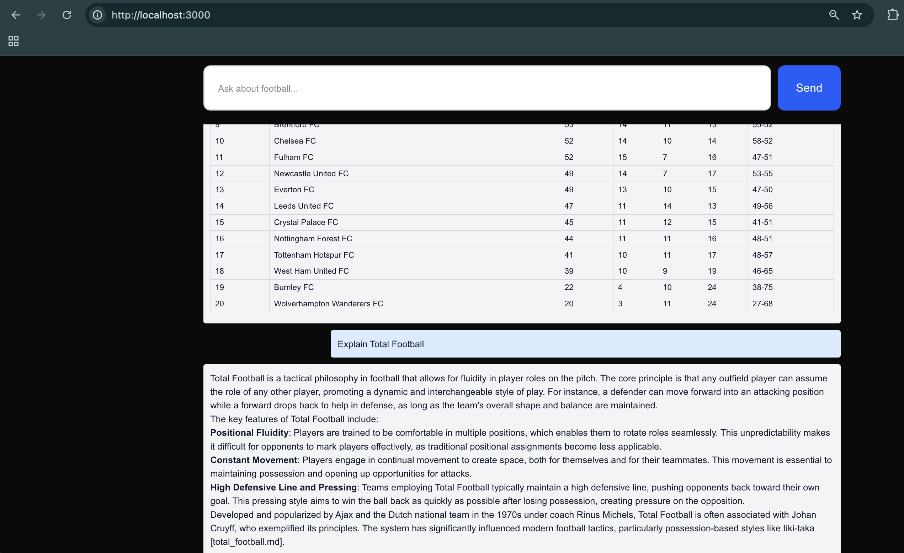

## 2. Postgres-backed persistent checkpointer

### Design decision: 
`AsyncPostgresSaver` manages its own database connection pool as an async context manager — it needs proper async setup/teardown, which doesn't fit our old pattern of building the graph once at module-import time (`soccermind_graph = build_graph()`, a synchronous call outside any event loop). So this requires restructuring: use FastAPI's lifespan feature to initialize the checkpointer and compiled graph once when the app actually starts (inside a real async context), storing the result on `app.state` instead of a module-level variable.

- backend/requirements.txt — add two packages
```
langgraph-checkpoint-postgres
psycopg[binary,pool]
```
- backend/app/config.py — add DATABASE_URL
- backend/app/agents/graph.py — build_graph now takes a checkpointer as a parameter
- backend/app/main.py — lifespan-managed Postgres checkpointer
- docker-compose.yml — add Postgres service

### Testing

1. `Basic sanity check` — ask any question through the chat UI, confirm it works exactly as before. This confirms the graph is still wired correctly with the new checkpointer.
    - Explain Total Football
    - What are the current La Liga standings?

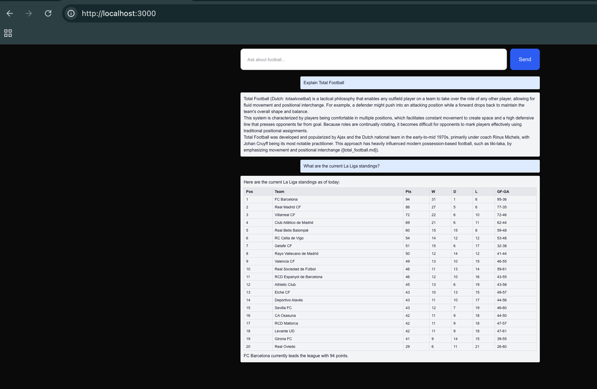

2. `Multi-turn memory still works` — ask a follow-up question (same kind of test as before, e.g. "Who won the World Cup in 2022?" → "How did they get there?"). This confirms Postgres is correctly storing and retrieving conversation state per thread_id, not just that the app didn't crash.

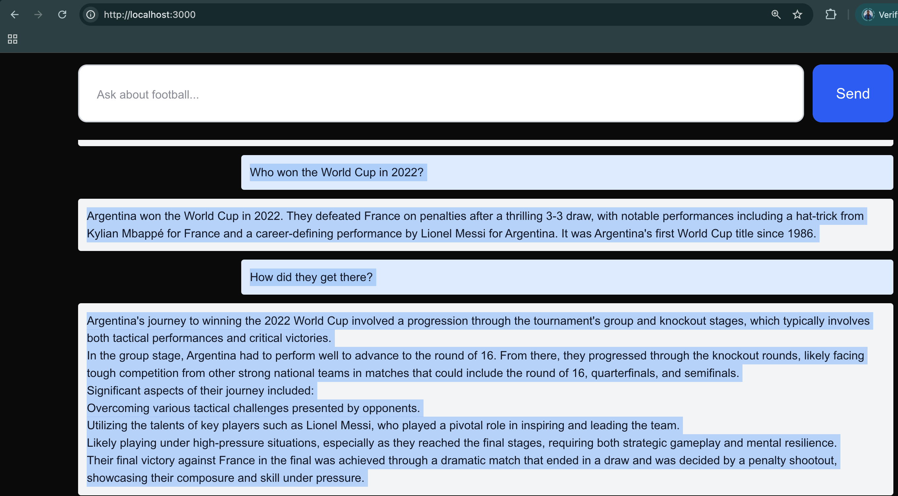

3. `The real test` — does memory survive a restart? This is the whole point of the Postgres upgrade, and something MemorySaver could never do. After a successful multi-turn conversation:


`docker compose restart backend`

Then, using the same browser tab (same threadId, since it's stored in React state and hasn't regenerated), ask another follow-up question referencing the earlier conversation. If it still has context from before the restart, Postgres persistence is genuinely working. If it's lost, something's off with how the connection/state is being loaded.

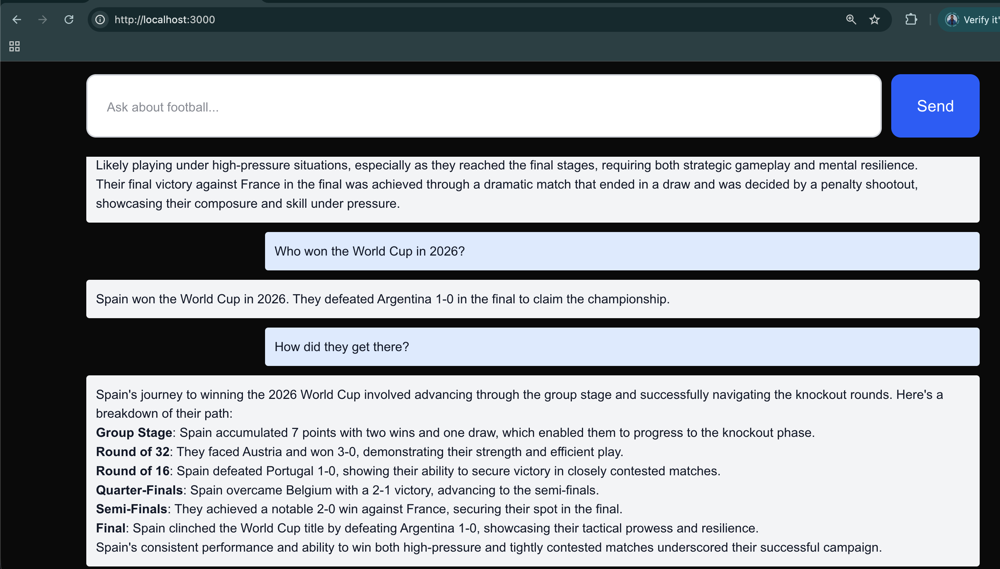

Note: LAst question is after backend restart - `it correctly retained full context`

4. Also worth a quick direct check, if you want to see it with your own eyes rather than infer it from behavior — connect to the Postgres container and confirm tables actually got created:

`docker compose exec postgres psql -U soccermind -d soccermind -c "\dt"`

```bash
# Output
 capstone % docker compose exec postgres psql -U soccermind -d soccermind -c "\dt"
                  List of relations
 Schema |         Name          | Type  |   Owner
--------+-----------------------+-------+------------
 public | checkpoint_blobs      | table | soccermind
 public | checkpoint_migrations | table | soccermind
 public | checkpoint_writes     | table | soccermind
 public | checkpoints           | table | soccermind
(4 rows)
```

That should list tables like checkpoints, checkpoint_writes, etc. — concrete proof the .setup() call actually created the schema, not just that the app didn't error out.

## 3. Conversation metadata (titles) - simpler version - title = the first user message (truncated), no extra LLM call needed

This needs its own small database table, since LangGraph's checkpoint tables store raw graph state, not human-readable metadata like titles.

Design note: I'll use a separate psycopg_pool.AsyncConnectionPool for this table (independent of the checkpointer's internal pool), following the same app.state-managed-resource pattern we just set up for the graph.

- backend/app/tools/conversations.py (new file) - 
- backend/app/main.py - now opens a second connection pool at startup (nested inside the checkpointer's own context manager, so both get torn down cleanly on shutdown), creates the conversations table once, and calls touch_conversation at the start of every /chat request — before the graph even runs, so the title/timestamp gets recorded regardless of what the agent does downstream.

### Testing

Rebuild, ask a question, then check directly that it worked:

`docker compose exec postgres psql -U soccermind -d soccermind -c "SELECT * FROM conversations;"`

You should see one row with a title truncated from your question and real timestamps. Try asking a follow-up in the same conversation too, and re-run that query — updated_at should change, but title should stay exactly as it was on the first message.

- Who won the World Cup in 2022?
```bash
capstone % docker compose exec postgres psql -U soccermind -d soccermind -c "SELECT * FROM conversations;"
              thread_id               |             title              |         created_at          |         updated_at
--------------------------------------+--------------------------------+-----------------------------+-----------------------------
 f7fb8c8e-cf4e-4ca9-a211-43c8ad155387 | Who won the World Cup in 2022? | 2026-07-29 23:57:13.2142+00 | 2026-07-29 23:57:13.2142+00
(1 row)

```
- Who won the golden boot?

```bash
 capstone % docker compose exec postgres psql -U soccermind -d soccermind -c "SELECT * FROM conversations;"
              thread_id               |             title              |         created_at          |          updated_at
--------------------------------------+--------------------------------+-----------------------------+-------------------------------
 f7fb8c8e-cf4e-4ca9-a211-43c8ad155387 | Who won the World Cup in 2022? | 2026-07-29 23:57:13.2142+00 | 2026-07-29 23:58:14.764794+00
(1 row)
```


## 4. New backend endpoints
Two new endpoints needed: 
- list all conversations, and 
- fetch a specific conversation's message history 
(so the frontend can restore it when you click on it in the sidebar).

### Design note on fetching history: 
The messages themselves aren't in our conversations table (that only has title/timestamps) — they're in LangGraph's checkpointer. The standard way to read a thread's current state without re-running anything is graph.aget_state(config), which just reads from the checkpointer.

What changed: two new GET endpoints added (list_conversations, get_conversation_messages); /chat itself is unchanged.

Two things worth understanding about get_conversation_messages:

1. msg.type is a standard LangChain property — "human" for HumanMessage, "ai" for AIMessage — mapping cleanly to our frontend's role: "user" | "assistant".
2. It only ever returns Human/AI messages, never the SystemMessages our agents build — those are constructed locally inside each node function for the LLM call, never returned/persisted into state["messages"], so they were never part of the saved state to begin with.

```bash
curl http://localhost:8000/conversations
curl http://localhost:8000/conversations/<thread_id from above>/messages

# Output
capstone % curl http://localhost:8000/conversations

[{"thread_id":"f7fb8c8e-cf4e-4ca9-a211-43c8ad155387","title":"Who won the World Cup in 2022?","created_at":"2026-07-29T23:57:13.214200+00:00","updated_at":"2026-07-29T23:58:14.764794+00:00"}]%

capstone % curl http://localhost:8000/conversations/f7fb8c8e-cf4e-4ca9-a211-43c8ad155387/messages

[{"role":"user","text":"Who won the World Cup in 2022?"},{"role":"assistant","text":"Argentina won the World Cup in 2022, defeating France on penalties after a 3-3 draw in the final."},{"role":"user","text":"Who won the golden boot?"},{"role":"assistant","text":"Kylian Mbappé won the Golden Boot at the 2022 World Cup."}]%
```

## 5. Frontend sidebar

### Component structure: 
I'm splitting this into three files — a small `lib/api.ts` for the two new REST calls (list conversations, fetch a conversation's history), a new `ConversationSidebar.tsx` presentational component, and `ChatInterface.tsx` becomes the "smart" parent that owns all the shared state (which conversation is active, the message list, the sidebar's data) and passes it down.

### Key behavior:
`threadId` used to be set once and never change (`useState(() => crypto.randomUUID())`); now it needs to actually change when you switch conversations, so it becomes regular mutable state. Switching conversations fetches that conversation's full history and replaces the message list; starting a new conversation just generates a fresh ID and clears the view — it won't appear in the sidebar until you actually send a first message (same as ChatGPT — an empty conversation isn't "a conversation" yet).

### Testing
1. send a message in a fresh conversation, confirm it appears in the sidebar after the response completes
- Who won the World Cup in 2022?
- How did they get there?

2. click "New Conversation," send a different question, confirm a second sidebar entry appears
- Explain Total Football.

3. click back to the first conversation, confirm its full history loads correctly into the main view.

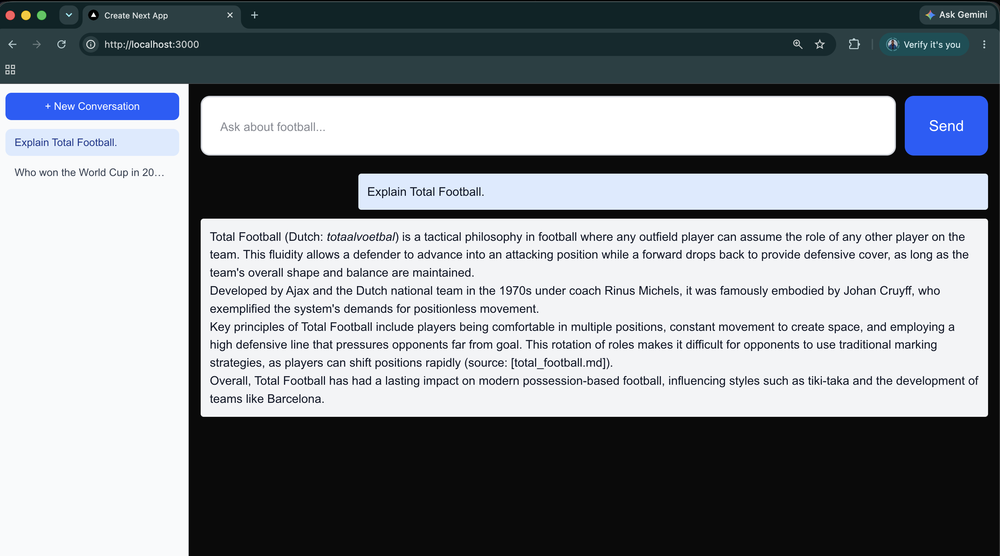

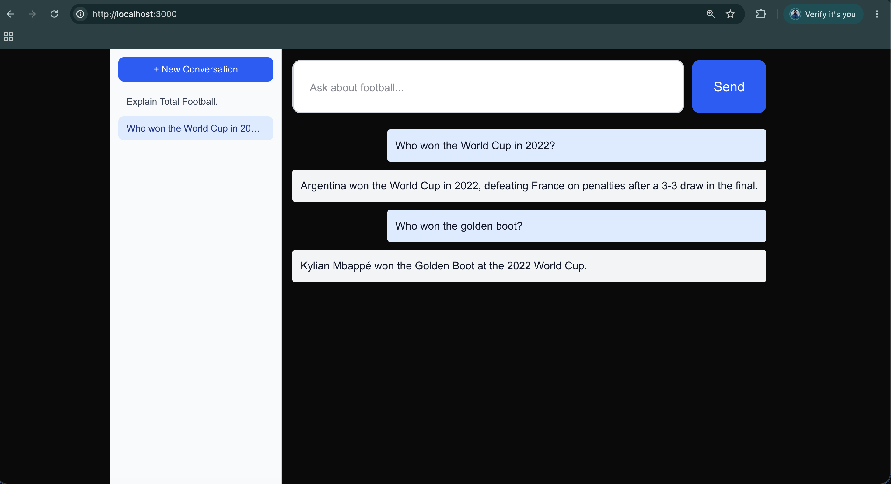

