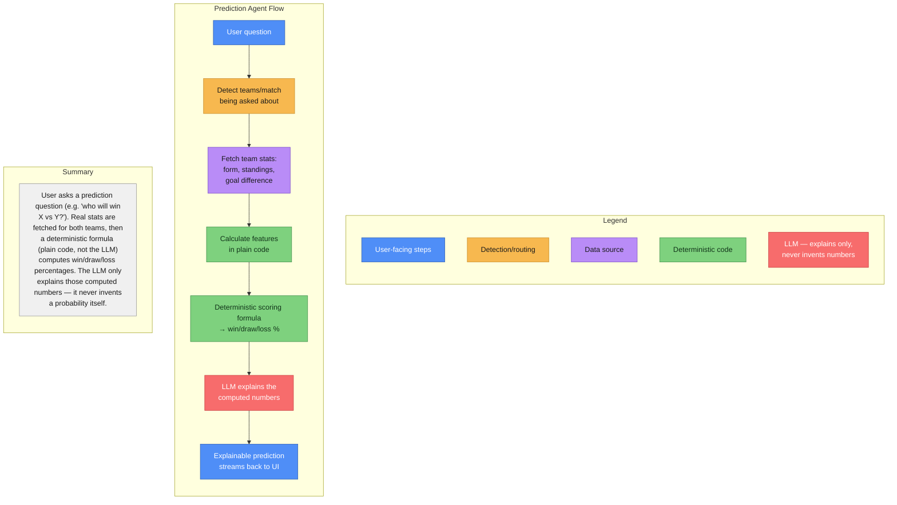
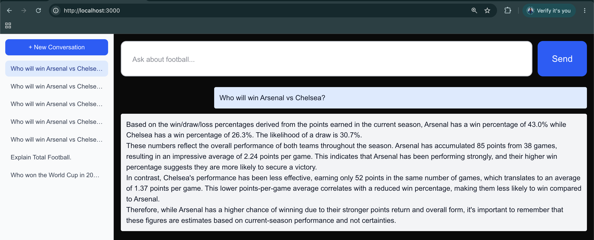
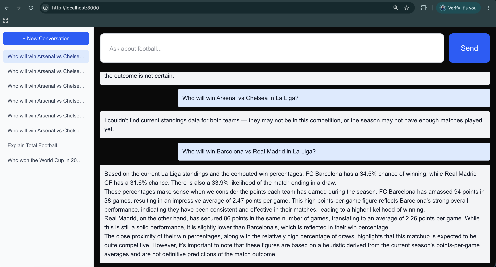
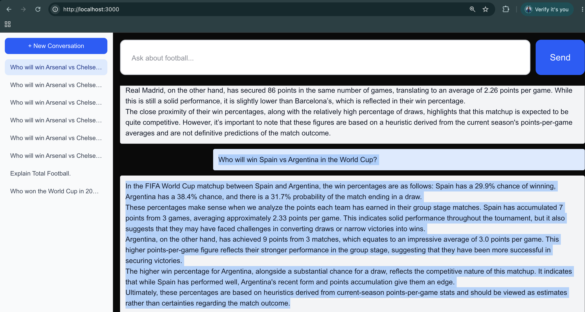
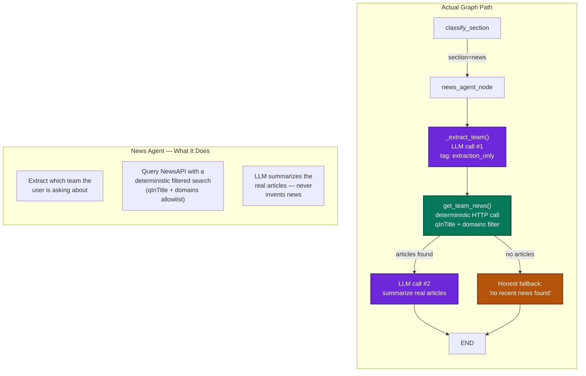
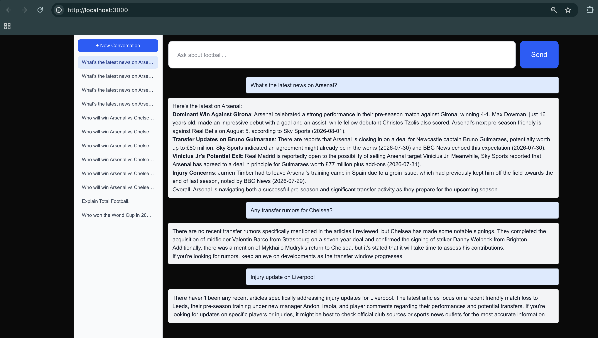
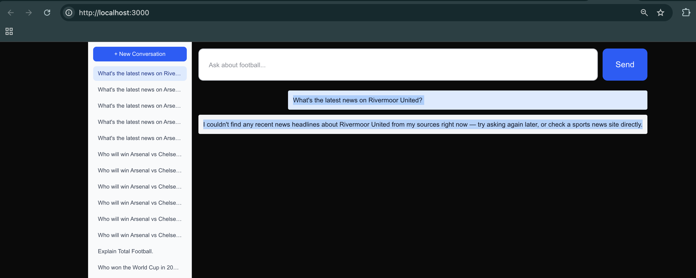
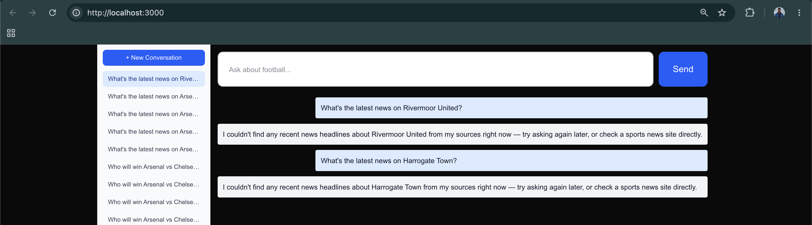
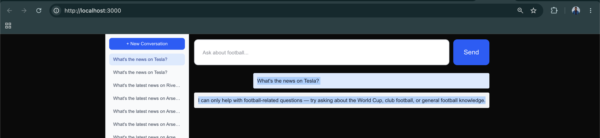

# Phase 3
Per PHASE_0.md, the original scope is: `Prediction Agent`, `Fantasy Assistant`, `News Agent`. Before diving in, here's how I'd sequence them and why — this matters given what Tactical Analyst taught us about verifying data availability before committing to a design.

`Prediction Agent` — build this first. Its design was already worked out carefully back in Phase 0: explicitly not ML model training — collect stats → calculate features in plain code → deterministic scoring formula → LLM explains the computed numbers only, never invents them. That design was made specifically to avoid the LLM hallucinating plausible-looking probabilities, and it happens to align exactly with every hard-won lesson from Phase 1/2 (don't trust the LLM to invent numbers, let code do deterministic work). Better still: the data it needs — team form, standings, head-to-head-ish signals — is mostly stuff football_api.py already gives us. Lowest risk, most ready to build.

`Fantasy Assistant and News Agent` both need upfront data verification, same as we did for Tactical Analyst, before we design anything. Fantasy Assistant's original spec calls for player-level data — injuries, expected minutes — which football-data.org has never shown us any sign of providing (we've only ever pulled team-level standings/results and basic scorer stats). News Agent needs an entirely new data source we haven't touched — a news API. Both are real open questions, not just implementation work; we should check what's actually available before committing to scope, the same way checking API-Football and football-data.org's actual stats coverage saved us from over-designing Tactical Analyst.

`Proposed order`: Prediction Agent (build now) → verify data availability for Fantasy Assistant → verify data availability for News Agent → build whichever of those two turn out to be viable as originally scoped, or scope them down honestly if not.

# Todos

- Draft Prediction Agent flow diagram - Done
- Build Prediction Agent (team detection, stats fetch, deterministic scoring, LLM explanation) - Done
- Verify data availability for Fantasy Assistant (player injuries, expected minutes) - Descoped due unavilability of free APIs
- Verify data availability for News Agent (news API research) - Done found https://newsapi.org/
- Build Fantasy Assistant (scope depends on data verification) - Descoped due unavilability of free APIs
- Build News Agent - Done

# Prediction Agent Flow



# Build Prediction Agent (team detection, stats fetch, deterministic scoring, LLM explanation)

`Scope`: specific two-team matches only, not whole-tournament predictions. "Who will win Arsenal vs Chelsea?" is answerable with a deterministic formula over two teams' current stats. "Who will win the World Cup?" would require simulating an entire bracket — genuinely out of scope for this design, and I'm keeping it that way rather than overreaching.

`Team-name extraction uses the LLM, deliberately.` This might look like it contradicts everything we've learned about not trusting the LLM — but there's an important distinction: identifying which two teams a question is about is ordinary entity extraction, a task LLMs are reliably good at. What we've learned not to trust the LLM with is inventing numbers or judging dates — narrow, specific weaknesses, not a blanket "never let the LLM do anything." Same reasoning as trusting it for auto-routing classification.

`Honesty flag on the formula itself:` the deterministic scoring formula below is a simple, explainable heuristic (points-per-game comparison), not a real statistical model (no Elo, no Poisson goal modeling — the kind of thing real sports-prediction systems use). It's good enough to demonstrate the "code computes, LLM only explains" architecture pattern honestly, but I don't want to oversell its actual predictive accuracy — and the LLM prompt explicitly says so too, rather than presenting it as more rigorous than it is.

## Testing

"Who will win Arsenal vs Chelsea?" — should give a genuine, computed percentage split with an LLM explanation, not an invented-sounding number.



### Some more questions - 

- "Who will win Manchester City vs Liverpool in the Premier League?"
- "Who will win Barcelona vs Real Madrid in La Liga?" (El Clásico — good one to try, we've directly confirmed both teams exist in our La Liga test data)
- "Who will win Bayern Munich vs Dortmund in the Bundesliga?"
- "Who will win Juventus vs AC Milan in Serie A?" (both confirmed present in our earlier Serie A test)
- "Who will win PSG vs Marseille in Ligue 1?"




Note - 
For question - Who will win Arsenal vs Chelsea in La Liga?,
Answer is - "I couldn't find current standings data for both teams — they may not be in this competition, or the season may not have enough matches played yet." - this is correct because Arsenal and Chelsea are Premier League clubs and genuinely don't play in La Liga.

- Who will win Spain vs Argentina in the World Cup?




## Trace

what happened for "Who will win Arsenal vs Chelsea?" using the real numbers from your test (Arsenal: 85 pts, Chelsea: 52 pts, both 38 games played → 43.0% / 26.3% / 30.7%), step by step through the actual code.

### Step 1: Team extraction (LLM call #1)

```python
extraction = await _match_extractor.ainvoke(
    f"Question: {state['question']}\nWhich two teams is this question about?",
    config={"tags": ["extraction_only"]},
)
```
This is a small, separate LLM call whose only job is reading the question and identifying two team names — no stats, no probabilities, nothing else. It uses structured output (the MatchExtraction Pydantic model), so instead of getting back free text the model might phrase differently each time, we get back a guaranteed shape: team_a="Arsenal", team_b="Chelsea". This is the same structured-output technique we've used throughout the project (the router's classifier, for example) — forcing the model into a fixed schema instead of parsing free text.

### Step 2: Competition detection (no LLM, just regex)

`competition_code = _detect_competition(state)`

Checks the question text for World Cup or league keywords. "Who will win Arsenal vs Chelsea?" doesn't explicitly say "Premier League," so nothing matches, and it falls through to the hardcoded default: "PL". Worth being honest about this — it's an assumption based on Arsenal/Chelsea being well-known PL clubs, not something actually confirmed from the question. If you asked about two teams that play in multiple competitions, this could pick the wrong one.

### Step 3: Fetch real standings (no LLM, an API call)

`standings = await get_standings(competition_code="PL")`

Calls football-data.org's /competitions/PL/standings endpoint — the same tool club_football_agent.py uses. Returns the full, real current Premier League table.

### Step 4: Find each team's row (no LLM, string matching)

```python
row_a = _find_team_row(standings, "Arsenal")  # → Arsenal FC: 85 pts, 38 games
row_b = _find_team_row(standings, "Chelsea")  # → Chelsea FC: 52 pts, 38 games
```

Simple substring match — "arsenal" found inside "Arsenal FC" — pulling out that team's actual row from the standings table (points, wins, draws, losses, games played).

### Step 5: Calculate the core feature — points per game

`form_a = 85 / 38 = 2.24`
`form_b = 52 / 38 = 1.37`

Points-per-game is a compact single number summarizing a team's whole season — a win is worth 3 points, a draw 1, a loss 0, so a high average means mostly winning, a low one means mostly losing/drawing.

### Step 6: The deterministic formula (no LLM — this is where the real math happens)
Draw probability, computed from how close the two teams' form is:

`closeness = 1 - abs(2.24 - 1.37) / 3 = 1 - 0.87/3 = 0.71`
`draw_prob = max(0.15, min(0.35, 0.20 + 0.15 * 0.71)) = 0.3065  →  30.7%`

The intuition: evenly matched teams draw more often in real football, so the formula gives a higher draw probability the closer the two teams' form is (clamped between 15%-35% so it never gets unrealistic).

Win probabilities, splitting whatever's left after the draw, proportionally to each team's form:

```python
remaining = 1 - 0.3065 = 0.6935
total_form = 2.24 + 1.37 = 3.61

win_a = 0.6935 * (2.24/3.61) = 0.4304  →  43.0%
win_b = 0.6935 * (1.37/3.61) = 0.2632  →  26.3%
```

Arsenal's form (2.24) is a bigger share of the combined total (3.61) than Chelsea's, so Arsenal gets a proportionally bigger slice of the non-draw probability. These numbers match exactly what you saw — all of this happened in plain Python, zero LLM involvement.

### Step 7: LLM explanation (LLM call #2 — the only one you actually see)

The already-computed numbers, plus the raw stats behind them, get handed to a second LLM call with an explicit instruction: these numbers are already final, don't invent or adjust them, just explain why they make sense. This call's only job is turning numbers into readable prose citing the real stats — which is exactly what streamed back to you.

### Step 6 explained in more detail
Let's break down every piece of this formula — both what it computes and, honestly, what's arbitrary about it.

```python
closeness = 1 - abs(form_a - form_b) / 3
draw_prob = max(0.15, min(0.35, 0.20 + 0.15 * closeness))
```

Why divide by 3? Points-per-game ranges from 0 (lost every match) to 3 (won every match) — so the maximum possible difference between any two teams is exactly 3 (one perfect team vs. one winless team). Dividing by 3 converts the raw difference into a 0-to-1 scale, where 1 means "as different as two teams could possibly be" and 0 means "identical form."

Why 1 - (that)? The raw calculation measures difference, but we want a variable called "closeness" — so it gets flipped: closeness = 1 means identical (maximally close), closeness = 0 means maximally different. For Arsenal/Chelsea: difference = 0.87, normalized = 0.29, closeness = 1 − 0.29 = 0.71 — moderately close, which matches intuition: Arsenal is clearly better, but Chelsea isn't at rock bottom either.

`0.20 + 0.15 * closeness — the baseline and the range:`

- 0.20 is the draw probability when `closeness = 0` (a maximally mismatched pairing) — the idea being even in a huge mismatch, football has enough randomness that a draw isn't impossible, so it's never treated as 0%.
- 0.15 is how much extra draw probability gets added as teams become more evenly matched. At `closeness = 1` (identical form), the formula gives 0.20 + 0.15 = 0.35.

So before any clamping, this linear formula already only ever produces values between 0.20 and 0.35.

Honest flag on these two numbers: 0.20 and 0.15 aren't derived from real historical draw-rate data — I picked them because they produce a range (20%-35%) that's roughly plausible for football (top-league draw rates commonly run somewhere in the 20s-percent historically), not because I fitted them to actual stats. This is exactly the "simple, explainable heuristic, not a validated model" caveat from when we built this — worth being clear that these specific numbers are illustrative, not empirically grounded.

Now the interesting part — the clamp is actually redundant. max(0.15, min(0.35, ...)) is meant to guarantee the final value never falls outside 15%-35%. But look at the math: since closeness is always between 0 and 1 by construction, the inner expression 0.20 + 0.15 * closeness can only ever produce values between 0.20 and 0.35 — which is already inside the 0.15-0.35 clamp range. So neither max(0.15, ...) nor min(0.35, ...) can ever actually change the result right now — they're dead code given the current formula.

That's not a bug — it's defensive programming that happens to not be doing anything yet. If the baseline or scaling constants ever get tuned later (e.g., widening the range to 10%-40%), the clamp would then genuinely start doing its job as a safety net. Harmless to leave in, just worth knowing it's not currently load-bearing — a good habit to notice when reading unfamiliar code, not just this one.

# Verify data availability for News Agent (news API research)
Add Key to .env NEWS_API_KEY=your_key_here

Key works, and the result is genuinely useful — real, current Arsenal transfer news from Sky Sports ("Papers: Arsenal closing in on deal for Newcastle captain Guimaraes", published today) sitting right alongside the actual match/injury-relevant content this agent needs.

But the test also surfaced a real problem worth flagging before we design around it: plain q=Arsenal keyword search is noisy. Only 2 of the 5 results were actually football-related — the other 3 were an unrelated Portuguese politics story, an Apple TV show review, and a general transfer story that happened to mention "Arsenal" in passing. NewsAPI's everything endpoint does broad full-text matching across its entire global news index, not a sports-scoped search.

The fix is straightforward and doesn't need the LLM to do the filtering: NewsAPI's everything endpoint supports qInTitle (only matches articles with the team name in the headline — much more precise) and domains (restrict to a known list of sports outlets like skysports.com,bbc.co.uk,espn.com). Combining both should get us close to signal-only results deterministically, the same "filter with code before handing to the LLM" pattern we used throughout this project.

# Build News Agent

## Flow Diagram


Why this shape: same skeleton as the Prediction Agent — deterministic fetch sandwiched between two LLM calls (extract, then explain) — because that pattern already solved the two hard problems you'll hit with any external-data agent: (1) don't let the LLM invent facts, only explain real ones you fetched in code, and (2) tag the extraction-only call so the SSE stream doesn't leak its raw JSON to the frontend, same as the Prediction Agent's MatchExtraction fix.

What's actually new here versus Prediction Agent: instead of "fetch one deterministic number and explain it," it's "fetch a list of real articles, deterministically filter out the noise (the Portuguese politics story, the Apple TV review), and have the LLM summarize only what's left." The filtering happens in the API query itself (qInTitle + domains), not as a separate code step — so there's no new LangGraph concept, just a new tool.

## Code changes
- 1. backend/app/config.py — add the news key
- 2. backend/app/tools/news_api.py — new file, the qInTitle+domains filtered fetch
    - Why qInTitle over plain q: your test showed q=Arsenal returning "Nuno Melo" Portuguese politics and an Apple TV review alongside real Arsenal news — the plain search matches the word anywhere in a huge global news index. qInTitle means the headline itself has to contain "Arsenal," which is a much stronger signal that the article is actually about Arsenal, not just mentioning it in passing.
- 3. backend/app/agents/news_agent.py — new file, the agent node
- 4. backend/app/agents/router.py — three targeted edits
    - a) Add news to the section descriptions:
    - b) Add the fast-path pattern and check it — same file, _fast_path_classify
    - c) Add "news" to the Literal type
- 5. backend/app/agents/graph.py — register the new agent node

## Testing

### 1. Isolated tool test first - verify the data layer before the full graph):

```python
# from backend/, with NEWS_API_KEY set in .env
python -c "
import asyncio
from app.tools.news_api import get_team_news
print(asyncio.run(get_team_news('Arsenal')))
"

# Output
backend % python -c "
import asyncio
from app.tools.news_api import get_team_news
print(asyncio.run(get_team_news('Arsenal')))
"
[{'source': {'id': None, 'name': 'Sky Sports'}, 'author': 'Noah Langford', 'title': 'Dowman dazzles and debutant Tzolis nets as Arsenal dominate Girona', 'description': 'Max Dowman, 16, dazzles with a goal and assist as Arsenal beat Girona 4-1 in Catalonia; debutant Christos Tzolis also scored; Arsenal face Real Betis on 5 August in their next pre-season friendly in Dublin', 'url': 'https://www.skysports.com/football/news/11670/13569056/girona-1-4-arsenal-max-dowman-and-christos-tzolis-score-as-gunners-record-dominant-win-in-first-pre-season-game', 'urlToImage': 'https://e0.365dm.com/26/08/1600x900/skysports-max-dowman-arsenal_7312002.jpg?20260801202741', 'publishedAt': '2026-08-01T15:58:00Z', 'content': 'Max Dowman dazzled with a goal and an assist as Arsenal recorded a dominant 4-1 win against Girona in their first pre-season game at Montilivi in Catalonia.\r\nThe 16-year-old was at the heart of every… [+2470 chars]'}, {'source': {'id': None, 'name': 'Sky Sports'}, 'author': None, 'title': 'Papers: Real Madrid open to possibility of Arsenal target Vinicius Jr exit', 'description': 'Latest transfer news and headlines as Arsenal agree a £77m plus add-ons deal for Newcastle captain Bruno Guimaraes; Chelsea avoid a 15-point deduction over that would have relegated them; Inter Milan are willing to pay £30m for Liverpool midfielder Curtis Jon…', 'url': 'https://www.skysports.com/football/transfer-paper-talk/12709/13568924/vinicius-junior-transfer-news-real-madrid-open-to-possibility-of-arsenal-target-leaving-paper-talk', 'urlToImage': 'https://e0.365dm.com/25/03/1600x900/skysports-paper-talk-brand-refresh_6852897.jpg?20250311094415', 'publishedAt': '2026-07-31T22:30:00Z', 'content': "The top stories and transfer rumours from Saturday's newspapers...\r\nArsenal\r\nReal Madrid are open to the possibility of Arsenal target Vinicius Junior leaving the club if there's no agreement on a ne… [+2331 chars]"}, {'source': {'id': None, 'name': 'Sky Sports'}, 'author': None, 'title': 'Papers: Arsenal closing in on deal for Newcastle captain Guimaraes', 'description': "Latest transfer news and headlines as Man Utd weigh up a move for Newcastle's Lewis Hall; Man Utd forward Marcus Rashford has no interest in joining Roma; Atletico Madrid rekindle their interest in Tottenham's Cristian Romero with Porto interested in Spurs le…", 'url': 'https://www.skysports.com/football/transfer-paper-talk/12709/13568628/bruno-guimaraes-transfer-news-arsenal-closing-in-on-deal-for-newcastle-captain-paper-talk', 'urlToImage': 'https://e0.365dm.com/25/03/1600x900/skysports-paper-talk-brand-refresh_6852897.jpg?20250311094415', 'publishedAt': '2026-07-30T21:50:00Z', 'content': "The top stories and transfer rumours from Friday's newspapers...\r\nBruno Guimaraes future\r\nArsenal have moved closer to agreeing a deal for Newcastle United's Bruno Guimaraes worth in the region of £8… [+2741 chars]"}, {'source': {'id': 'bbc-news', 'name': 'BBC News'}, 'author': 'Sami Mokbel', 'title': 'Newcastle captain Guimaraes expected to join Arsenal', 'description': 'There is a growing expectation that Newcastle captain Bruno Guimaraes will join Arsenal this summer in a deal worth up to £80m.', 'url': 'https://www.bbc.co.uk/sport/football/articles/cgewqpp5e57o', 'urlToImage': 'https://ichef.bbci.co.uk/ace/branded_sport/1200/cpsprodpb/e1db/live/8274e610-8c1f-11f1-a7ab-8b30adf0800a.jpg', 'publishedAt': '2026-07-30T14:39:37Z', 'content': 'There is growing expectation that Newcastle captain Bruno Guimaraes will join Arsenal this summer, multiple sources have told BBC Sport.\r\nThe Brazil midfielder has made it clear he wants to join the … [+1388 chars]'}, {'source': {'id': 'bbc-news', 'name': 'BBC News'}, 'author': 'Sami Mokbel', 'title': 'Timber leaves Arsenal camp over groin issue', 'description': "Jurrien Timber travels back to London from Arsenal's training camp in Spain in a move related to the groin injury that caused him to miss the end of last season.", 'url': 'https://www.bbc.co.uk/sport/football/articles/cpq8ndn0g7go', 'urlToImage': 'https://ichef.bbci.co.uk/ace/branded_sport/1200/cpsprodpb/5fc1/live/d6077610-8b4a-11f1-8139-b39d1c7486b2.jpg', 'publishedAt': '2026-07-29T13:14:41Z', 'content': "Jurrien Timber has travelled back to London from Arsenal's training camp in Spain in a move related to the groin injury that caused him to miss the end of last season.\r\nThe Netherlands international … [+955 chars]"}]
```

Confirm it returns real, on-topic articles (headline actually contains "Arsenal") — not the Portuguese-politics/Apple-TV noise from your earlier raw q= test.

Step 1 (isolated tool test) passes cleanly. All 5 results:

Have "Arsenal" actually in the headline (qInTitle working)
Are from Sky Sports or BBC News (both presumably in your domains allowlist)
Are genuinely relevant: pre-season match report, Guimaraes transfer (2 versions from different papers), and a real injury update (Timber's groin issue) — no Portuguese-politics or Apple-TV noise like the raw q= test surfaced

### 2. Rebuild backend (per your known workflow — no auto-reload):

Add a temporary print right where the fast-path result is decided in router.py, so you can see whether it skipped the LLM entirely and matched "news" correctly:

```python
async def classify_section(state: GraphState) -> dict:
    fast_path = _fast_path_classify(state)
    print(f"[DEBUG] question={state['question']!r} fast_path={fast_path!r}")
    if fast_path:
        return {"section": fast_path, "section_valid": True}
```

```bash
docker compose up --build -d backend
docker compose ps backend          # check STATUS/CREATED timestamp is recent
docker compose logs backend        # confirm clean startup, no traceback

```

### 3. Routing / fast-path test — ask questions that should hit NEWS_PATTERN without touching the LLM classifier:

"What's the latest news on Arsenal?"
"Any transfer rumors for Chelsea?"
"Injury update on Liverpool"

Check the terminal/logs (or add a temporary print) to confirm these skip the LLM classifier and go straight to section="news".



### 4. Happy path (articles found) — confirm the response actually streams text 
(this is exactly what the VALID_NODES bug above would silently break — if you see an empty/hung response, that's the symptom), and that the summary only cites real article content, no invented details.

### 5. Fallback path (no articles) — 
- Ask about a team/spelling unlikely to have qualifying headlines (e.g. an obscure lower-table club). Confirm you get the honest "no recent news found" fallback, and — per your Phase 1 lesson — check this path still reaches the frontend correctly, since it returns without an LLM call and won't emit on_chat_model_stream events at all (needs the non-streaming SSE fallback, same as the World Cup agent's API-limit fallback).

- Good candidate for a guaranteed zero-result test — use a team name that doesn't exist, so there's no chance of an unlucky real match:

`"What's the latest news on Rivermoor United?"`

Why this works reliably: NewsAPI's qInTitle filter requires the literal string to appear in a real headline — a made-up club name can't match anything, so you're testing the code path, not hoping for an unlucky slow news day on a real team.

#### Expected Results - 
1. Backend logs should show fast_path='news' (regex still matches "news"), then TeamExtraction(team='Rivermoor United') — the extractor doesn't validate the team is real, it just extracts what was asked.

2. If you kept the [DEBUG] team=... articles=... print in news_agent.py, confirm articles=[].

3. The chat response should show the honest fallback text from news_agent.py:52-58: "I couldn't find any recent news headlines about Rivermoor United..."

Backend logs - 
```bash
backend-1  | [DEBUG] question="What's the latest news on Rivermoor United?" fast_path='news'
backend-1  | /usr/local/lib/python3.13/site-packages/pydantic/main.py:475: UserWarning: Pydantic serializer warnings:
backend-1  |   PydanticSerializationUnexpectedValue(Expected `none` - serialized value may not be as expected [field_name='parsed', input_value=TeamExtraction(team='Rivermoor United'), input_type=TeamExtraction])
backend-1  |   return self.__pydantic_serializer__.to_python(
backend-1  | [DEBUG] team='Rivermoor United' articles=[]
backend-1  | INFO:     172.66.0.243:24543 - "GET /conversations HTTP/1.1" 200 OK
```

4. This is the no-LLM-call path — I checked main.py's SSE handler (lines 123-126) and confirmed it already has the non-streaming fallback wired correctly: on_chain_end for a node in VALID_NODES (which now includes "news") yields output["answer"] whenever tokens_streamed is still False. So the fallback message should still arrive in the UI, not hang — that's specifically what this test verifies.



#### Secondary check 
while you're at it: try one more with a real but obscure lower-league club unlikely to be covered by your SPORTS_DOMAINS allowlist (e.g. a League Two side) to see how it behaves on a realistic "no article happened to be published in my window" case rather than a literally-nonexistent team — good to know both branches behave the same way.

Try `"What's the latest news on Harrogate Town?"` (a real English National League club).

`Why this one specifically`: it's a genuine, currently-active club (not a fabricated name like Rivermoor United), but small enough that your SPORTS_DOMAINS allowlist (skysports.com,bbc.co.uk,espn.com,goal.com,theguardian.com) may or may not have run a recent headline naming them specifically — unlike the Premier League clubs you've tested, this isn't guaranteed either way.

- If articles=[] — same honest fallback path, but now proven on a real club, not just a nonsense name. Confirms the fallback isn't somehow tied to extraction "failing" on fake names.
- If articles has real hits — good chance to sanity-check summarization quality on a smaller, less-mainstream club with likely thinner coverage (maybe 1 article instead of 5) — worth checking the LLM doesn't pad out a single real result into an overconfident-sounding multi-point summary.



Backend logs - 
```bash
backend-1  | [DEBUG] question="What's the latest news on Harrogate Town?" fast_path='news'
backend-1  | /usr/local/lib/python3.13/site-packages/pydantic/main.py:475: UserWarning: Pydantic serializer warnings:
backend-1  |   PydanticSerializationUnexpectedValue(Expected `none` - serialized value may not be as expected [field_name='parsed', input_value=TeamExtraction(team='Harrogate Town'), input_type=TeamExtraction])
backend-1  |   return self.__pydantic_serializer__.to_python(
backend-1  | [DEBUG] team='Harrogate Town' articles=[]
backend-1  | INFO:     172.66.0.243:46681 - "GET /conversations HTTP/1.1" 200 OK
```

### 6. Extraction leak check — 
Watch the raw SSE stream (browser devtools Network tab, or curl /chat directly) and confirm no raw JSON from _extract_team()'s structured output appears — the extraction_only tag skip in main.py should filter it.

### 7. Off-topic guard — 
Ask something like "What's the news on Tesla?" and confirm it's classified "none", not misrouted into news.



Backend logs - 
```bash
backend-1  | [DEBUG] question="What's the news on Tesla?" fast_path=None
backend-1  | /usr/local/lib/python3.13/site-packages/pydantic/main.py:475: UserWarning: Pydantic serializer warnings:
backend-1  |   PydanticSerializationUnexpectedValue(Expected `none` - serialized value may not be as expected [field_name='parsed', input_value=SectionClassification(sec...is not about football.'), input_type=SectionClassification])
backend-1  |   return self.__pydantic_serializer__.to_python(
backend-1  | INFO:     172.66.0.243:37929 - "GET /conversations HTTP/1.1" 200 OK
```

### 8. Regression check — 
Re-run one Prediction Agent question ("Who will win Arsenal vs Chelsea?") and one Club Football question to make sure the new NEWS_PATTERN/PREDICTION_PATTERN fast-paths and the reordered path_map didn't shift any existing routing.

- One Prediction Agent question  - Who will win Arsenal vs Chelsea?
- One Club Football question - What are Premier League standings?

Backend logs - 
```bash
backend-1  | [DEBUG] question='Who will win Arsenal vs Chelsea?' fast_path='prediction'
backend-1  | === PREDICTION AGENT REACHED ===
backend-1  | /usr/local/lib/python3.13/site-packages/pydantic/main.py:475: UserWarning: Pydantic serializer warnings:
backend-1  |   PydanticSerializationUnexpectedValue(Expected `none` - serialized value may not be as expected [field_name='parsed', input_value=MatchExtraction(team_a='A...enal', team_b='Chelsea'), input_type=MatchExtraction])
backend-1  |   return self.__pydantic_serializer__.to_python(
backend-1  | INFO:     172.66.0.243:41772 - "GET /conversations HTTP/1.1" 200 OK

...

backend-1  | [DEBUG] question='What are Premier League standings?' fast_path='club_football'
backend-1  | INFO:     172.66.0.243:31181 - "GET /conversations HTTP/1.1" 200 OK
```


# Known scope limitation — small/lower-league clubs

Tested with two real, low-profile clubs (Harrogate Town, National League) and one deliberately fictional one (Rivermoor United) — both correctly triggered the honest "couldn't find any recent news" fallback rather than inventing anything, which is the desired behavior. But this surfaces a real coverage boundary worth being upfront about:

`qInTitle` + the `SPORTS_DOMAINS` allowlist (`skysports.com, bbc.co.uk, espn.com, goal.com, theguardian.com`) means the News Agent can only ever report news for clubs big enough that one of these five major outlets ran a headline naming them directly.
Smaller/lower-league clubs will hit the "no news found" fallback far more often than top-flight clubs — not because nothing is happening at the club, just because our filtered sources didn't headline it. Same honesty tradeoff as the qInTitle/domains filter itself: better to say "found nothing" than to loosen filtering and risk noise (Portuguese politics, Apple TV reviews) creeping back in.

`Scope, stated plainly`: News Agent is reliable for major clubs (Premier League, top European leagues, national teams) and will frequently return "no news found" for smaller clubs — this is a known, accepted limitation, not a bug.

# What I Learned (Phase 3 — News Agent)

## Conversation Memory Isn't a Free Win
- Passing full conversation history (`state["messages"]`) into an LLM call is not a safe default for every node — it's right for genuine follow-ups (e.g. "how did they get there?" needing prior context), but actively harmful for a call that's supposed to be grounded only in freshly fetched, per-turn data.
- Concretely: asking about Arsenal news, then Chelsea, then Liverpool in the same conversation caused the LLM to blend the *previous* team's real facts (a transfer story, an injury) into the *current* team's answer under the new team's name — even though the newly fetched articles never contained those facts. The LLM effectively "remembered" the wrong thing at the wrong time.
- The fix was per-node, not global: drop full history for this specific summarization call and build the prompt from just the current question + the data just fetched. Every node that mixes "long-lived conversation context" with "one-shot fresh data" needs this judgment call made explicitly — I can't assume more context is always safer.
- I only caught this because I compared the LLM's stated facts against a raw debug print of what was actually fetched — without that print, the answer read as plausible and I could easily have accepted it as correct.

## Fast-Path Regex Needs to Be Scoped, Not Just Matched
- A deterministic fast-path regex that checks for a generic keyword (e.g. bare `\bnews\b`) can match completely off-topic questions ("What's the news on Tesla?") and route them straight past the LLM classifier's off-topic detection — even though the classifier itself handles that case correctly when it actually runs.
- The fix: require the pattern to include real section-specific context (transfer/injury phrasing, or "news" co-occurring with team/club keywords), not just a word that could appear in any domain.
- Because the downstream node degraded gracefully (an honest "no articles found" fallback, not a hallucinated answer), this bug was low-severity — but it's the same *class* of mistake as writing an over-broad regex anywhere: test what it matches, not just what you intended it to match.

## Infra Gotchas Worth Checking Every Time a New Env Var Is Added
- A new required field on a pydantic `Settings` class with no default crashes the entire app at import time if missing — not a graceful error, a full startup failure.
- Docker Compose does **not** auto-forward `.env` variables into a service's container — only variables explicitly referenced (`- NEW_VAR=${NEW_VAR}`) in that service's `environment:` block actually reach the container, even if the var is correctly set in `.env` on the host.
- Any SSE/streaming filter keyed off an explicit node allowlist (like `VALID_NODES`) needs every new node added by hand — forgetting it doesn't error, it just silently drops all streamed output for that node.

## Testing Practice
- Running a fixed checklist (isolated tool test → routing → happy path → fallback path → leak check → off-topic guard → regression check) caught two real, non-obvious bugs that "looks correct at a glance" testing would have missed — especially the history-bleed bug, which only appears across *multiple turns in one conversation*, not in a single isolated question.
- Testing a single question in isolation isn't enough for any agent that has conversation memory — the regression has to be tested as a multi-turn sequence to surface state-carryover bugs.
